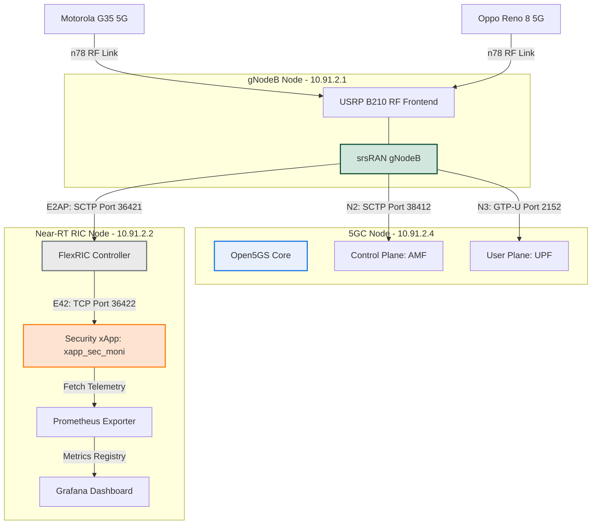
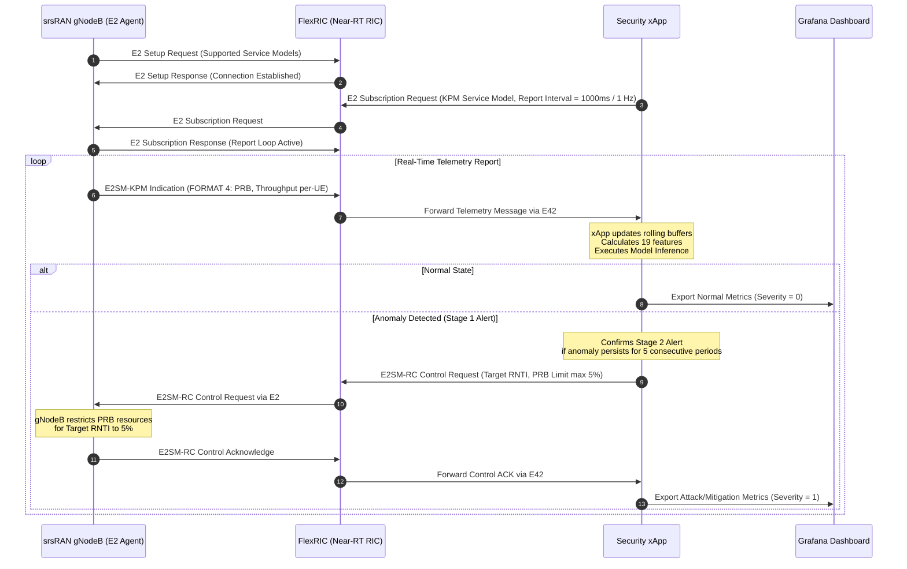
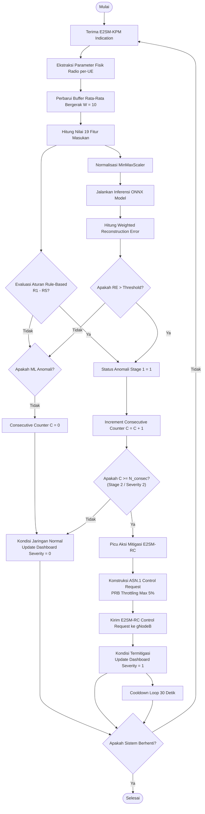

# BAB III DETIL DESAIN DAN IMPLEMENTASI

## 3.1 Model Desain

Penyusunan bab ini diawali dengan perancangan model desain sistem yang memetakan seluruh unit logis, hubungan antarkomponen, serta pembagian fungsionalitas rekayasa. Sistem diimplementasikan pada lingkungan testbed fisik multi-node berskala lokal di Laboratorium Telematika. Perancangan model deteksi anomali mencakup dua model deteksi berbasis pembelajaran mendalam temporal, yaitu model **LSTM-Autoencoder** dan model **GRU-Autoencoder**, serta logika penapisan aturan (*Rule-Based*) yang digabungkan ke dalam bentuk sistem deteksi hibrida paralel. Pengujian dilakukan dengan mengevaluasi kemampuan *security xApp* dalam mendeteksi dan menangkal serangan *Denial of Service* (DoS) menggunakan ketiga metode deteksi tersebut. Parameter yang menjadi acuan dalam melakukan pengukuran performa sistem adalah *Recall*, *F1-score*, *False Positive Rate* (FPR), latensi deteksi, dan latensi mitigasi.

---

### 3.1.1 Subsistem Integrasi dan Komunikasi E2

Subsistem Integrasi dan Komunikasi E2 memfasilitasi pertukaran data telemetri dan aksi kontrol antara gNodeB (E2 Node) dengan Near-RT RIC melalui antarmuka standardisasi O-RAN. Arsitektur fungsional terintegrasi dirancang menggunakan topologi multi-node fisik yang terhubung di dalam satu Local Area Network (LAN) dengan segmen subnet `10.91.2.0/24`. Topologi fisik ini memisahkan secara tegas beban komputasi Core Network, Radio Access Network (RAN), dan Near-RT RIC untuk menyimulasikan arsitektur komersial yang sesungguhnya. Komponen-komponen fisik yang digunakan meliputi:
1.  **Core Node (IP `10.91.2.4`)**: Bertindak sebagai 5G Core (5GC) bare metal yang menjalankan platform Open5GS untuk memproses persinyalan (*signaling*) (AMF) dan rute bidang data (UPF).
2.  **RAN Node (IP `10.91.2.1`)**: Menjalankan gNodeB berbasis srsRAN Project yang terhubung secara fisik ke perangkat Software Defined Radio (SDR) Ettus USRP B210 sebagai pemancar sinyal nirkabel n78. Node ini bertindak sebagai E2 Node yang menampung E2 Agent bawaan.
3.  **RIC Node (IP `10.91.2.2`)**: Menjalankan platform FlexRIC Near-RT RIC serta *Security-Related xApp* (`xapp_sec_moni`) secara native.
4.  **Terminal Pengguna (UE)**: Menggunakan perangkat smartphone fisik (Oppo Reno 8 5G dan Motorola G35 5G) yang dilengkapi kartu SIM terprogram untuk terhubung langsung ke gNodeB.

Model konektivitas dan interaksi fungsional sistem terintegrasi disajikan pada Gambar 3.1.


<p align="center">Gambar 3.1 Arsitektur Fungsional Sistem Terintegrasi pada Testbed 5G-SA O-RAN</p>

Sistem kontrol mitigasi berjalan dalam model loop tertutup (*closed-loop control*) yang berbasis pada protokol O-RAN E2AP, E2SM-KPM, dan E2SM-RC. Aliran persinyalan asinkron antara RAN Node, Near-RT RIC, dan xApp digambarkan melalui diagram urutan pada Gambar 3.2.


<p align="center">Gambar 3.2 Diagram Urutan Aliran Informasi Persinyalan Kontrol Loop Tertutup</p>

---

### 3.1.2 Subsistem Deteksi Anomali Hibrida

Subsistem Deteksi Anomali Hibrida dirancang untuk mendeteksi kondisi tidak biasa atau serangan DoS pada jaringan secara paralel dengan memadukan model *Machine Learning* temporal (LSTM-Autoencoder dan GRU-Autoencoder) dan penapisan aturan manual (*Rule-Based*).

#### 1. Pemodelan Model LSTM-Autoencoder
Model LSTM-Autoencoder (LSTM-AE) merupakan model deteksi anomali tanpa pengawasan (*unsupervised*) yang memproses data metrik temporal per-UE dengan panjang window temporal ($T$) sebesar 30 sampel. Pada laju aktual pelaporan E2SM-KPM FlexRIC sebesar 1000 ms per laporan (1 Hz), panjang urutan ini mewakili memori temporal sistem selama 30 detik ($30 \times 1$ detik). 

Data masukan model berupa telemetri RAN yang diekstraksi dari pesan kontainer E2SM-KPM Indication. Untuk menangkap karakteristik lalu lintas data secara akurat pada tingkat pengguna, dirancang skema ekstraksi **19 fitur per-UE** seperti yang didefinisikan pada Tabel 3.1.

**Tabel 3.1 Skema 19 Fitur Masukan Tingkat Pengguna (Per-UE) untuk Model LSTM-Autoencoder**

| # | Nama Fitur | Definisi Matematis / Deskripsi | Batas Normalisasi |
|---|---|---|---|
| 1 | `prb_usage_dl_ratio` | $\text{PRB}_{\text{used, DL}} / (\text{PRB}_{\text{used, DL}} + \text{PRB}_{\text{avail, DL}})$ | $[0, 1]$ |
| 2 | `prb_usage_ul_ratio` | $\text{PRB}_{\text{used, UL}} / (\text{PRB}_{\text{used, UL}} + \text{PRB}_{\text{avail, UL}})$ | $[0, 1]$ |
| 3 | `thp_dl_kbps` | Throughput Downlink pengguna aktual (kbps) | $[0, 1]$ (scaled) |
| 4 | `thp_ul_kbps` | Throughput Uplink pengguna aktual (kbps) | $[0, 1]$ (scaled) |
| 5 | `prb_direction` | $(\text{PRB}_{\text{UL}} - \text{PRB}_{\text{DL}}) / (\text{PRB}_{\text{total}} + \epsilon)$ | $[-1, 1]$ |
| 6 | `prb_total` | $\text{PRB}_{\text{DL}} + \text{PRB}_{\text{UL}}$ | $[0, 1]$ |
| 7 | `prb_ul_delta` | $\text{PRB}_{\text{UL}}[t] - \text{PRB}_{\text{UL}}[t-1]$ | $[-1, 1]$ (scaled) |
| 8 | `ul_efficiency` | $\text{Throughput}_{\text{UL}} / \text{PRB}_{\text{UL}}$ | $[0, 1]$ (scaled) |
| 9 | `prb_ul_roll_mean` | Rata-rata bergerak $\text{PRB}_{\text{UL}}$ ($W_{\text{roll}} = 10$) | $[0, 1]$ |
| 10 | `prb_ul_roll_std` | Deviasi standar bergerak $\text{PRB}_{\text{UL}}$ ($W_{\text{roll}} = 10$) | $[0, 1]$ |
| 11 | `ul_persistence` | Fraksi $\text{PRB}_{\text{UL}} > 0$ dalam 10 sampel terakhir | $[0, 1]$ |
| 12 | `thp_total_kbps` | $\text{Throughput}_{\text{DL}} + \text{Throughput}_{\text{UL}}$ | $[0, 1]$ (scaled) |
| 13 | `thp_ul_delta` | $\text{Throughput}_{\text{UL}}[t] - \text{Throughput}_{\text{UL}}[t-1]$ | $[-1, 1]$ (scaled) |
| 14 | `thp_dl_delta` | $\text{Throughput}_{\text{DL}}[t] - \text{Throughput}_{\text{DL}}[t-1]$ | $[-1, 1]$ (scaled) |
| 15 | `traffic_direction` | $(\text{Throughput}_{\text{UL}} - \text{Throughput}_{\text{DL}}) / (\text{Throughput}_{\text{total}} + \epsilon)$ | $[-1, 1]$ |
| 16 | `prb_ul_burst_index` | $\ln(1 + \text{PRB}_{\text{UL}}) / (\text{PRB}_{\text{ul\_roll\_mean}} + \epsilon)$ | $[0, 50]$ (scaled) |
| 17 | `prb_dl_burst_index` | $\ln(1 + \text{PRB}_{\text{DL}}) / (\text{PRB}_{\text{dl\_roll\_mean}} + \epsilon)$ | $[0, 50]$ (scaled) |
| 18 | `thp_ul_burst_index` | $\text{Throughput}_{\text{UL}} / (\text{Throughput}_{\text{ul\_roll\_mean}} + 1)$ | $[0, 50]$ (scaled) |
| 19 | `thp_dl_burst_index` | $\text{Throughput}_{\text{DL}} / (\text{Throughput}_{\text{dl\_roll\_mean}} + 1)$ | $[0, 50]$ (scaled) |

Sebelum dimasukkan ke dalam model LSTM-AE, data metrik aktual $x_t \in \mathbb{R}^{d}$ ($d=19$) dinormalisasi terlebih dahulu ke dalam rentang $[0, 1]$ menggunakan metode MinMaxScaler:
$$x'_{t,i} = \frac{x_{t,i} - x_{\text{min},i}}{x_{\text{max},i} - x_{\text{min},i}}$$
di mana $x_{\text{min},i}$ dan $x_{\text{max},i}$ diperoleh secara luring dari data lalu lintas normal (*benign dataset*).

Arsitektur model LSTM-AE dirancang dengan struktur *Encoder* dan *Decoder* simetris berbasis gerbang LSTM unidirectional. Blok diagram fungsional pemrosesan LSTM-AE digambarkan pada Gambar 3.3.

```
              [ Input Matrix (30 x 19) — fitur mentah ]
                                │
                                ▼
                 [ MinMaxScaler (baked-in ONNX) ]
                                │
                                ▼
              [ Encoder: LSTM Layer 1 (64 units, 1 arah) ]
                                │
                                ▼
              [ Encoder: LSTM Layer 2 (32 units, 1 arah) ]
                                │
                                ▼
            [ Temporal Attention (bobot antar-timestep) ]
                                │
                                ▼
              [ Dense → Latent Vector z (32) ]
                                │
                                ▼
        [ Dense Proyeksi (32) + Repeat Vector (x 30 steps) ]
                                │
                                ▼
              [ Decoder: LSTM Layer 1 (64 units) ]
                                │
                                ▼
              [ Decoder: LSTM Layer 2 (19 units) ]
                                │
                                ▼
              [ Reconstructed Matrix (30 x 19) ]
                                │
                                ▼
      [ Weighted MSE (Scheme A) → skalar RE (baked-in ONNX) ]
```
<p align="center">Gambar 3.3 Blok Diagram Fungsional Arsitektur Model LSTM-Autoencoder</p>

Kesalahan rekonstruksi (*Reconstruction Error* - $RE$) dihitung sebagai **rata-rata Weighted Mean Squared Error (Weighted MSE) pada seluruh $T = 30$ langkah waktu**, berdasarkan selisih antara matriks fitur masukan ternormalisasi $x'$ dan matriks hasil rekonstruksi model $\hat{x}$. Untuk mengoptimalkan sensitivitas deteksi terhadap fitur yang paling diskriminatif, digunakan skema pembobotan (*Scheme A*):
$$RE = \sum_{i=1}^{d} \bar{w}_i \left( \frac{1}{T}\sum_{t=1}^{T} (x'_{t,i} - \hat{x}_{t,i})^2 \right), \qquad \bar{w}_i = \frac{w_i}{\sum_{j=1}^{d} w_j}$$
di mana $w_i$ adalah bobot fitur ke-$i$ yang diturunkan dari analisis kontribusi error per-fitur antara kondisi serangan dan normal. Normalisasi MinMaxScaler dan perhitungan Weighted MSE ini **dibakukan (*baked-in*) ke dalam berkas ONNX**, sehingga keluaran model langsung berupa skalar $RE$. Status anomali temporal (Stage 1 alert) terpicu apabila $RE$ melampaui batas ambang keputusan optimal ($Th$) yang dikalibrasi pada batas persentil ke-97 (P97) dari error rekonstruksi **data validasi normal**:
$$\text{Status Anomali Stage 1} = \begin{cases} 1, & \text{jika } RE > Th \\ 0, & \text{jika } RE \le Th \end{cases}$$
di mana ambang keputusan optimal $Th$ untuk model LSTM-AE ini ditetapkan sebesar **`0.025266`**.

#### 2. Pemodelan Model GRU-Autoencoder
Model *Bidirectional Gated Recurrent Unit Autoencoder* (BiGRU-AE) merupakan model deteksi anomali tanpa pengawasan (*unsupervised*) yang memproses data metrik temporal per-UE dengan panjang window temporal ($T$) sebesar 30 sampel (memori temporal sistem selama 30 detik pada laju pelaporan 1000 ms / 1 Hz).

Data masukan model berupa telemetri RAN yang diekstraksi dari pesan kontainer E2SM-KPM Indication. Untuk menangkap karakteristik lalu lintas data secara akurat pada tingkat pengguna, dirancang skema ekstraksi **19 fitur per-UE** seperti yang didefinisikan pada Tabel 3.2.

**Tabel 3.2 Skema 19 Fitur Masukan Tingkat Pengguna (Per-UE) untuk Model GRU-Autoencoder**

| # | Nama Fitur | Definisi Matematis / Deskripsi | Batas Normalisasi |
|---|---|---|---|
| 1 | `prb_usage_dl_ratio` | $\text{PRB}_{\text{used, DL}} / (\text{PRB}_{\text{used, DL}} + \text{PRB}_{\text{avail, DL}})$ | $[0, 1]$ |
| 2 | `prb_usage_ul_ratio` | $\text{PRB}_{\text{used, UL}} / (\text{PRB}_{\text{used, UL}} + \text{PRB}_{\text{avail, UL}})$ | $[0, 1]$ |
| 3 | `thp_dl_kbps` | Throughput Downlink pengguna aktual (kbps) | $[0, 1]$ (scaled) |
| 4 | `thp_ul_kbps` | Throughput Uplink pengguna aktual (kbps) | $[0, 1]$ (scaled) |
| 5 | `prb_direction` | $(\text{PRB}_{\text{UL}} - \text{PRB}_{\text{DL}}) / (\text{PRB}_{\text{total}} + \epsilon)$ | $[-1, 1]$ |
| 6 | `prb_total` | $\text{PRB}_{\text{DL}} + \text{PRB}_{\text{UL}}$ | $[0, 1]$ |
| 7 | `prb_ul_delta` | $\text{PRB}_{\text{UL}}[t] - \text{PRB}_{\text{UL}}[t-1]$ | $[-1, 1]$ (scaled) |
| 8 | `ul_efficiency` | $\text{Throughput}_{\text{UL}} / \text{PRB}_{\text{UL}}$ | $[0, 1]$ (scaled) |
| 9 | `prb_ul_roll_mean` | Rata-rata bergerak $\text{PRB}_{\text{UL}}$ ($W_{\text{roll}} = 10$) | $[0, 1]$ |
| 10 | `prb_ul_roll_std` | Deviasi standar bergerak $\text{PRB}_{\text{UL}}$ ($W_{\text{roll}} = 10$) | $[0, 1]$ |
| 11 | `ul_persistence` | Fraksi $\text{PRB}_{\text{UL}} > 0$ dalam 10 sampel terakhir | $[0, 1]$ |
| 12 | `thp_total_kbps` | $\text{Throughput}_{\text{DL}} + \text{Throughput}_{\text{UL}}$ | $[0, 1]$ (scaled) |
| 13 | `thp_ul_delta` | $\text{Throughput}_{\text{UL}}[t] - \text{Throughput}_{\text{UL}}[t-1]$ | $[-1, 1]$ (scaled) |
| 14 | `thp_dl_delta` | $\text{Throughput}_{\text{DL}}[t] - \text{Throughput}_{\text{DL}}[t-1]$ | $[-1, 1]$ (scaled) |
| 15 | `traffic_direction` | $(\text{Throughput}_{\text{UL}} - \text{Throughput}_{\text{DL}}) / (\text{Throughput}_{\text{total}} + \epsilon)$ | $[-1, 1]$ |
| 16 | `prb_ul_burst_index` | $\ln(1 + \text{PRB}_{\text{UL}}) / (\text{PRB}_{\text{ul\_roll\_mean}} + \epsilon)$ | $[0, 50]$ (scaled) |
| 17 | `prb_dl_burst_index` | $\ln(1 + \text{PRB}_{\text{DL}}) / (\text{PRB}_{\text{dl\_roll\_mean}} + \epsilon)$ | $[0, 50]$ (scaled) |
| 18 | `thp_ul_burst_index` | $\text{Throughput}_{\text{UL}} / (\text{Throughput}_{\text{ul\_roll\_mean}} + 1)$ | $[0, 50]$ (scaled) |
| 19 | `thp_dl_burst_index` | $\text{Throughput}_{\text{DL}} / (\text{Throughput}_{\text{dl\_roll\_mean}} + 1)$ | $[0, 50]$ (scaled) |

Sebelum dimasukkan ke dalam model GRU-AE, data metrik aktual $x_t \in \mathbb{R}^{d}$ ($d=19$) dinormalisasi terlebih dahulu ke dalam rentang $[0, 1]$ menggunakan metode MinMaxScaler:
$$x'_{t,i} = \frac{x_{t,i} - x_{\text{min},i}}{x_{\text{max},i} - x_{\text{min},i}}$$
di mana $x_{\text{min},i}$ dan $x_{\text{max},i}$ diperoleh secara luring dari data lalu lintas normal (*benign dataset*).

Arsitektur model GRU-AE dirancang dengan struktur *Encoder* dua arah (bidirectional GRU) dan *Decoder* satu arah simetris. Blok diagram fungsional pemrosesan GRU-AE digambarkan pada Gambar 3.4.

```
              [ Input Matrix (30 x 19) — fitur mentah ]
                                │
                                ▼
                 [ MinMaxScaler (baked-in ONNX) ]
                                │
                                ▼
          [ Encoder: BiGRU Layer 1 (hidden 64, 2 arah) ]
                                │
                                ▼
          [ Encoder: BiGRU Layer 2 (hidden 32, 2 arah) ]
                                │
                                ▼
            [ Temporal Attention (bobot antar-timestep) ]
                                │
                                ▼
              [ Dense → Latent Vector z (32) ]
                                │
                                ▼
        [ Dense Proyeksi (32) + Repeat Vector (x 30 steps) ]
                                │
                                ▼
          [ Decoder: GRU Layer 1 (64 units, 1 arah) ]
                                │
                                ▼
          [ Decoder: GRU Layer 2 (19 units, 1 arah) ]
                                │
                                ▼
              [ Reconstructed Matrix (30 x 19) ]
                                │
                                ▼
      [ Weighted MSE (Scheme A) → skalar RE (baked-in ONNX) ]
```
<p align="center">Gambar 3.4 Blok Diagram Fungsional Arsitektur Model GRU-Autoencoder</p>

Kesalahan rekonstruksi ($RE$) model GRU-AE dihitung dengan rumus Weighted MSE yang sama, yaitu rata-rata pada seluruh $T = 30$ langkah waktu (dengan MinMaxScaler dan pembobotan Scheme A turut dibakukan ke dalam ONNX):
$$RE = \sum_{i=1}^{d} \bar{w}_i \left( \frac{1}{T}\sum_{t=1}^{T} (x'_{t,i} - \hat{x}_{t,i})^2 \right), \qquad \bar{w}_i = \frac{w_i}{\sum_{j=1}^{d} w_j}$$
Status anomali temporal terpicu apabila nilai kesalahan rekonstruksi melampaui batas ambang keputusan optimal $Th$ model GRU-AE yang dikalibrasi pada persentil ke-97 (P97) data validasi normal, sebesar **`0.025969`**:
$$\text{Status Anomali Stage 1} = \begin{cases} 1, & \text{jika } RE_t > Th \\ 0, & \text{jika } RE_t \le Th \end{cases}$$

#### 3. Aturan Deteksi Berbasis Aturan (Rule-Based)
Pendekatan *Rule-Based* dirancang untuk mendeteksi tanda-tanda serangan DoS secara cepat menggunakan parameter ambang batas yang ditentukan berdasarkan analisis lalu lintas normal (*benign dataset*). Aturan deteksi berbasis aturan (R1 hingga R5) didefinisikan secara spesifik pada Tabel 3.3.

**Tabel 3.3 Parameter Aturan Deteksi Berbasis Aturan (Rule-Based)**

| Aturan | Deskripsi / Target Serangan | Kondisi Pemicu Anomali | Jumlah Sampel Beruntun ($N_{\text{consec}}$) | Tingkat Keparahan (*Severity*) |
|---|---|---|---|---|
| **R1** | Uplink DoS Flood | $\text{Throughput}_{\text{UL}} > 15000 \text{ kbps}$ atau $\text{PRB}_{\text{UL}} > 0,70$ | 5 | 1 (Warning) |
| **R2** | Downlink DoS Flood | $\text{Throughput}_{\text{DL}} > 15000 \text{ kbps}$ atau $\text{PRB}_{\text{DL}} > 0,85$ | 5 | 1 (Warning) |
| **R3** | Burst DoS ON/OFF | $\text{roll\_std} > 0,12$ dan $\text{roll\_mean} > 0,05$ | 5 | 1 (Warning) |
| **R4** | Persistence / RoQ DoS | $\text{persistence} \ge 0,90$ dan $\text{roll\_mean} > 0,50$ | 10 | 2 (Critical) |
| **R5** | LDoS / Efisiensi Rendah | $\text{PRB}_{\text{UL}} > 0,30$ dan $\text{ul\_efficiency} < 5000 \text{ kbps/PRB}$ | 3 | 2 (Critical) |

Setiap aturan di atas memerlukan sejumlah sampel beruntun ($N_{\text{consec}}$) tertentu agar status anomali dapat terkonfirmasi, guna menghindari alarm palsu akibat fluktuasi sesaat (*spikes*). Tingkat keparahan *Severity 2 (Critical)* pada R4 dan R5 mewakili kondisi serangan kritis yang langsung memicu mitigasi kontrol secara cepat tanpa menunggu konfirmasi akumulatif tambahan.

#### 4. Logika Deteksi Hibrida Paralel dan Pemicuan Mitigasi
Alur logika deteksi hibrida paralel pada xApp menggabungkan kedua pendekatan di atas untuk mencapai cakupan deteksi serangan DoS yang andal. Aksi kontrol mitigasi E2SM-RC dipicu ketika deteksi mencapai tingkat kritis (*Stage 2 / Severity 2*), yaitu setelah status anomali terkonfirmasi beruntun sesuai ambang masing-masing aturan ($N_{\text{consec}}$ bernilai 3–10 sampel sebagaimana Tabel 3.3) atau ketika skor *Reconstruction Error* model ML melampaui ambang secara persisten. Diagram alir prosedur logika ini digambarkan pada Gambar 3.5.


<p align="center">Gambar 3.5 Diagram Alir Logika Deteksi Hibrida Paralel dan Mitigasi Loop Tertutup pada xApp</p>

---

### 3.1.3 Subsistem Dashboard Visualisasi dan Monitoring

Subsistem monitoring dirancang untuk mencatat data lalu lintas nirkabel serta memvisualisasikan status deteksi secara langsung (*real-time*). Struktur penyimpanan data menggunakan berkas **Comma-Separated Values (CSV)** dengan struktur log yang terperinci. Pencatatan log latih per-UE memuat kolom parameter berikut:
`timestamp_ms`, `datetime`, `rnti`, `prb_usage_dl_ratio`, `prb_usage_ul_ratio`, `thp_dl_kbps`, `thp_ul_kbps`, `prb_direction`, `prb_total`, `prb_ul_delta`, `ul_efficiency`, `prb_ul_roll_mean`, `prb_ul_roll_std`, `ul_persistence`, `thp_total_kbps`, `thp_ul_delta`, `thp_dl_delta`, `traffic_direction`, `label`.

Selain itu, xApp menulis berkas log peristiwa (*alert*) terpisah dengan kolom: `timestamp_ms`, `rnti`, `rule_mask`, `rule_stage`, `mse`, `threshold`, `alert_type`.

Visualisasi real-time direalisasikan melalui modul **Prometheus Exporter berbasis Python** (`csv_exporter.py`, memanfaatkan pustaka `prometheus_client`) yang membaca berkas log CSV xApp lalu mengeksposnya sebagai metrik terstruktur. Modul ini menyediakan antarmuka HTTP scraping yang kemudian ditarik secara periodik oleh server database Prometheus untuk ditampilkan pada dashboard **Grafana**.

---

## 3.2 Implementasi

Realisasi rancangan sistem diwujudkan ke dalam bentuk konfigurasi fisik perangkat keras, pembuatan model pembelajaran mendalam, serta pengkodean program xApp dalam lingkungan testbed.

### 3.2.1 Subsistem Integrasi dan Komunikasi E2

Realisasi subsistem ini mencakup konfigurasi lingkungan testbed fisik multi-node, integrasi perutean data pada 5G Core, serta implementasi aksi kontrol mitigasi E2SM-RC pada sisi Near-RT RIC.

#### 1. Realisasi Lingkungan Testbed (srsRAN & Open5GS)
Testbed fisik dikonfigurasi pada tiga unit PC server bare metal yang seluruhnya menjalankan OS **Ubuntu 24.04.4 LTS** dan saling terhubung menggunakan kabel Gigabit Ethernet. Spesifikasi perangkat keras tiap node dirinci pada Tabel 3.4.

**Tabel 3.4 Spesifikasi Perangkat Keras Tiap Node Testbed**

| Node | IP | CPU | Jumlah Core | RAM |
|---|---|---|---|---|
| RAN (gNodeB) | `10.91.2.1` | Intel Core i5-6500 @3.20GHz | 4 | 32 GB |
| Near-RT RIC | `10.91.2.2` | Intel Core i5-7500 @3.40GHz | 4 | 32 GB |
| 5G Core | `10.91.2.4` | Intel Core i5-8500T @2.10GHz | 6 | 32 GB |

##### A. Konfigurasi gNodeB (srsRAN Project)
Konfigurasi gNodeB didefinisikan menggunakan format YAML pada berkas `cots_n78_copied.yml`. Konfigurasi agen E2 internal diaktifkan agar gNodeB dapat melakukan inisialisasi koneksi E2AP SCTP ke RIC Node (IP `10.91.2.2`).

```yaml
# cots_n78_copied.yml - Konfigurasi gNodeB & E2 Agent srsRAN
amf:
  addr: 10.91.2.4          # AMF (Core Node)
  port: 38412              # N2 (NGAP/SCTP)
  bind_addr: 10.91.2.1

ru_sdr:
  device_driver: uhd
  device_args: type=b200   # Ettus USRP B210
  srate: 46.08
  tx_gain: 80
  rx_gain: 40

cell_cfg:
  dl_arfcn: 627340         # Pita n78
  band: 78
  channel_bandwidth_MHz: 40
  common_scs: 30           # Subcarrier spacing 30 kHz
  plmn: '00101'            # MCC 001 / MNC 01
  tac: 7
  pci: 1

e2:
  enable_du_e2: true
  e2sm_kpm_enabled: true
  e2sm_rc_enabled: true    # wajib aktif untuk mitigasi E2SM-RC
  addr: 10.91.2.2          # Near-RT RIC
  port: 36421              # E2AP (SCTP)
  bind_addr: 10.91.2.1
```

##### B. Konfigurasi 5G Core (Open5GS)
Pengaturan alokasi IP pool UE dan DNN dikonfigurasi pada berkas SMF (`smf.yaml`) di Core Node, sedangkan irisan jaringan (*S-NSSAI*, SST=1 eMBB) didefinisikan pada tingkat PLMN (`00101`). Antarmuka layanan internal Open5GS (SBI/PFCP/GTP-U) menggunakan alamat loopback.

```yaml
# smf.yaml - Konfigurasi SMF Open5GS (Core Node)
smf:
  sbi:
    - address: 127.0.0.4   # SBI internal Open5GS (loopback)
      port: 7777
  pfcp:
    - address: 127.0.0.4
  gtpu:
    - address: 127.0.0.4
  session:
    - subnet: 10.45.0.0/16     # Alokasi IP Pool untuk UE (DNN: internet)
    - subnet: 2001:db8:cafe::/48
```

#### 2. Realisasi Subsistem Mitigasi E2SM-RC
Aksi kontrol mitigasi ditangani oleh modul E2SM-RC yang menyusun kode ASN.1 pesan persinyalan E2SM-RC Control Request untuk membatasi alokasi Physical Resource Block (PRB) pada sisi gNodeB.

```c
// xapp_sec_mitigate.c - E2SM-RC Control Trigger (Style 2 / Action 6)
// Membatasi alokasi PRB (RRM Policy Ratio) untuk UE target.

// Control Header (Format 1): Style 2, Action 6, UE ID = gNB-DU F1AP
static e2sm_rc_ctrl_hdr_frmt_1_t build_ctrl_hdr(void) {
    e2sm_rc_ctrl_hdr_frmt_1_t hdr = {0};
    hdr.ric_style_type = 2;   // Style 2: Radio Resource Allocation Control
    hdr.ctrl_act_id    = 6;   // Action 6: PRB Quota / RRM Policy
    hdr.ue_id.type     = GNB_DU_UE_ID_E2SM;
    hdr.ue_id.gnb_du.gnb_cu_ue_f1ap = g_ue_f1ap;
    return hdr;
}

// Eksekusi: kirim Control Request berisi RRM Policy Ratio (max PRB = max_prb%)
static int execute_rc_control(int max_prb) {
    rc_ctrl_req_data_t rc_ctrl = {0};
    rc_ctrl.hdr.format = FORMAT_1_E2SM_RC_CTRL_HDR;
    rc_ctrl.hdr.frmt_1 = build_ctrl_hdr();
    rc_ctrl.msg.format = FORMAT_1_E2SM_RC_CTRL_MSG;
    rc_ctrl.msg.frmt_1 = build_ctrl_msg(max_prb);  // RRM Policy: min=0, max=ded=max_prb

    control_sm_xapp_api(&g_du_node_id, g_rc_rf_id, &rc_ctrl);
    free_rc_ctrl_req_data(&rc_ctrl);
    printf("[MITIGATE] E2SM-RC sent: max_prb=%d%%\n", max_prb);  // throttle=5, restore=100
    return 1;
}
```

---

### 3.2.2 Subsistem Deteksi Anomali Hibrida

Realisasi deteksi anomali diwujudkan melalui pemrograman model pembelajaran mendalam berbasis PyTorch, ekspor model ke format ONNX, serta pengintegrasian engine ONNX Runtime C API pada unit xApp FlexRIC.

#### 1. Pelatihan Model LSTM-Autoencoder & Ekspor ONNX
Pembuatan arsitektur model LSTM-Autoencoder ditulis menggunakan bahasa pemrograman Python 3.10 dengan pustaka PyTorch 2.1. Model didefinisikan secara simetris sesuai rancangan pemodelan fungsional.

```python
# lstm_autoencoder.py - PyTorch Model Definition
import torch
import torch.nn as nn

class TemporalAttention(nn.Module):
    """Self-attention antar-timestep: memberi bobot lebih pada timestep anomalous."""
    def __init__(self, hidden_dim):
        super().__init__()
        self.attn = nn.Linear(hidden_dim, 1)
    def forward(self, out):                                   # (B, T, H)
        w = torch.softmax(self.attn(out).squeeze(-1), dim=1).unsqueeze(-1)
        return (out * w).sum(dim=1)                           # (B, H)

class LSTMEncoder(nn.Module):
    def __init__(self, no_features, hidden=[64, 32], latent_dim=32):
        super().__init__()
        # LSTM unidirectional (bidirectional=False untuk model LSTM-AE)
        self.lstm1 = nn.LSTM(no_features, hidden[0], batch_first=True)
        self.lstm2 = nn.LSTM(hidden[0],   hidden[1], batch_first=True)
        self.attention = TemporalAttention(hidden[1])
        self.fc = nn.Linear(hidden[1], latent_dim)
    def forward(self, x):
        out, _ = self.lstm1(x)
        out, _ = self.lstm2(out)
        return self.fc(self.attention(out))                  # (B, latent_dim)

class LSTMDecoder(nn.Module):
    def __init__(self, latent_dim=32, hidden=[32, 64], no_features=19, seq_len=30):
        super().__init__()
        self.seq_len = seq_len
        self.fc = nn.Linear(latent_dim, hidden[0])
        self.lstm1 = nn.LSTM(hidden[0], hidden[1],   batch_first=True)
        self.lstm2 = nn.LSTM(hidden[1], no_features, batch_first=True)
    def forward(self, z):
        h = self.fc(z).unsqueeze(1).repeat(1, self.seq_len, 1)  # proyeksi + repeat x30
        out, _ = self.lstm1(h)
        out, _ = self.lstm2(out)
        return out                                           # (B, seq_len, no_features)

class LSTMAutoencoder(nn.Module):
    def __init__(self, seq_len=30, no_features=19, latent_dim=32):
        super().__init__()
        self.encoder = LSTMEncoder(no_features, [64, 32], latent_dim)
        self.decoder = LSTMDecoder(latent_dim, [32, 64], no_features, seq_len)
    def forward(self, x):
        return self.decoder(self.encoder(x))
```

Setelah proses pelatihan menggunakan data normal selesai, model dikonversi menjadi berkas portabel ONNX agar dapat dimuat dan dijalankan secara native oleh xApp C menggunakan engine ONNX Runtime C API.

```python
# export_onnx_ue.py - Bake MinMaxScaler + Weighted MSE (Scheme A) ke dalam ONNX
import torch, pickle
import torch.nn as nn
from src.detection.lstm_autoencoder import LSTMAutoencoder
from src.detection.feature_schema_ue import FEATURE_WEIGHTS, FEATURE_NAMES

class ONNXPerUEWrapper(nn.Module):
    """Input: fitur mentah [B,30,19] → Output: skalar Weighted MSE (node 'mse')."""
    def __init__(self, model, scaler, weights):
        super().__init__()
        self.model = model
        self.a = nn.Parameter(torch.tensor(scaler.scale_, dtype=torch.float32), requires_grad=False)
        self.b = nn.Parameter(torch.tensor(scaler.min_,   dtype=torch.float32), requires_grad=False)
        self.w = nn.Parameter(weights / weights.sum(), requires_grad=False)  # Scheme A ternormalisasi

    def forward(self, x):
        x = x * self.a + self.b                 # MinMaxScaler
        recon = self.model(x)
        fe = ((x - recon) ** 2).mean(dim=1)     # rata-rata 30 timestep -> [B, 19]
        return (fe * self.w).sum(dim=-1)        # Weighted MSE skalar -> [B]

model = LSTMAutoencoder(seq_len=30, no_features=19, latent_dim=32)
model.load_state_dict(torch.load("models/lstm_ue_v4.pt", map_location="cpu")["model_state_dict"])
scaler  = pickle.load(open("models/lstm_ue_v4_scaler.pkl", "rb"))
weights = torch.tensor([FEATURE_WEIGHTS[n] for n in FEATURE_NAMES])
wrapped = ONNXPerUEWrapper(model.eval(), scaler, weights).eval()

torch.onnx.export(
    wrapped, torch.zeros(1, 30, 19), "models/lstm_ue_v4.onnx",
    opset_version=14, do_constant_folding=True,
    input_names=["input"], output_names=["mse"],
    dynamic_axes={"input": {0: "batch"}, "mse": {0: "batch"}},
)
print("Model LSTM-AE (scaler + weighted MSE) berhasil diekspor ke ONNX.")
```

#### 2. Pelatihan Model GRU-Autoencoder & Ekspor ONNX
Modul `gru_autoencoder.py` ditulis untuk mendefinisikan jaringan saraf temporal berbasis unit GRU dua arah (*BiGRU*).

```python
# gru_autoencoder.py - PyTorch Model Definition
import torch
import torch.nn as nn
from src.detection.lstm_autoencoder import TemporalAttention

class GRUEncoder(nn.Module):
    def __init__(self, no_features, hidden=[64, 32], latent_dim=32, bidirectional=True):
        super().__init__()
        D = 2 if bidirectional else 1            # BiGRU: tiap layer keluaran hidden*2
        self.gru1 = nn.GRU(no_features,  hidden[0], batch_first=True, bidirectional=bidirectional)
        self.gru2 = nn.GRU(hidden[0]*D,  hidden[1], batch_first=True, bidirectional=bidirectional)
        self.attention = TemporalAttention(hidden[1]*D)
        self.fc = nn.Linear(hidden[1]*D, latent_dim)
    def forward(self, x):
        out, _ = self.gru1(x)
        out, _ = self.gru2(out)
        return self.fc(self.attention(out))      # (B, latent_dim)

class GRUDecoder(nn.Module):                     # unidirectional
    def __init__(self, latent_dim=32, hidden=[32, 64], no_features=19, seq_len=30):
        super().__init__()
        self.seq_len = seq_len
        self.fc = nn.Linear(latent_dim, hidden[0])
        self.gru1 = nn.GRU(hidden[0], hidden[1],   batch_first=True)
        self.gru2 = nn.GRU(hidden[1], no_features, batch_first=True)
    def forward(self, z):
        h = self.fc(z).unsqueeze(1).repeat(1, self.seq_len, 1)
        out, _ = self.gru1(h)
        out, _ = self.gru2(out)
        return out

class GRUAutoencoder(nn.Module):
    def __init__(self, seq_len=30, no_features=19, latent_dim=32):
        super().__init__()
        self.encoder = GRUEncoder(no_features, [64, 32], latent_dim, bidirectional=True)
        self.decoder = GRUDecoder(latent_dim, [32, 64], no_features, seq_len)
    def forward(self, x):
        return self.decoder(self.encoder(x))
```

Setelah model dilatih, model diekspor ke file ONNX menggunakan skrip berikut agar dapat dimuat oleh mesin ONNX Runtime C API.

```python
# export_onnx_ue.py --arch gru : ekspor GRU-AE dengan wrapper yang sama
import torch, pickle
from src.detection.gru_autoencoder import GRUAutoencoder
from src.detection.feature_schema_ue import FEATURE_WEIGHTS, FEATURE_NAMES
# ONNXPerUEWrapper identik dengan ekspor LSTM (scaler + Weighted MSE -> skalar "mse")

model = GRUAutoencoder(seq_len=30, no_features=19, latent_dim=32)
model.load_state_dict(torch.load("models/gru_ue_v4.pt", map_location="cpu")["model_state_dict"])
scaler  = pickle.load(open("models/gru_ue_v4_scaler.pkl", "rb"))
weights = torch.tensor([FEATURE_WEIGHTS[n] for n in FEATURE_NAMES])
wrapped = ONNXPerUEWrapper(model.eval(), scaler, weights).eval()

torch.onnx.export(
    wrapped, torch.zeros(1, 30, 19), "models/gru_ue_v4.onnx",
    opset_version=14, do_constant_folding=True,
    input_names=["input"], output_names=["mse"],
    dynamic_axes={"input": {0: "batch"}, "mse": {0: "batch"}},
)
print("Model GRU-AE (scaler + weighted MSE) berhasil diekspor ke ONNX.")
```

#### 3. Integrasi ONNX Runtime C API pada xApp
xApp keamanan dibangun menggunakan bahasa pemrograman C Native dengan memanfaatkan SDK FlexRIC. xApp ini memuat model ONNX secara real-time pada saat inisialisasi awal.

```c
// sec_ids_ue.c - ONNX Runtime C API Initialization
#include <onnxruntime_c_api.h>
#include "sec_ids_ue.h"

OrtEnv* g_ort_env = NULL;
OrtSession* g_ort_session = NULL;
OrtSessionOptions* g_session_options = NULL;
OrtMemoryInfo* g_memory_info = NULL;

int init_onnx_runtime(const char* model_path) {
    const OrtApi* g_ort = OrtGetApiBase()->GetApi(ORT_API_VERSION);
    if (!g_ort) return -1;

    // Inisialisasi Environment ONNX
    g_ort->CreateEnv(ORT_LOGGING_LEVEL_WARNING, "SecurityxAppEnv", &g_ort_env);
    g_ort->CreateSessionOptions(&g_session_options);
    g_ort->SetSessionOptionsCpuMemArenaState(g_session_options, 1);

    // Buat Session Baru
    OrtStatus* status = g_ort->CreateSession(g_ort_env, model_path, g_session_options, &g_ort_session);
    if (status != NULL) {
        g_ort->ReleaseStatus(status);
        return -1;
    }

    g_ort->CreateCpuMemoryInfo(OrtArenaAllocator, OrtMemTypeDefault, &g_memory_info);
    return 0; // Inisialisasi Sukses
}
```

Setiap kali laporan metrik E2SM-KPM dari UE tertentu diterima, xApp menghitung 19 fitur masukan temporal lalu menjalankan inferensi ONNX. Karena normalisasi MinMaxScaler dan perhitungan Weighted MSE telah dibakukan ke dalam berkas ONNX, masukan model berupa **fitur mentah** `[1, 30, 19]` dan keluarannya berupa **skalar Reconstruction Error** (node `mse`). Layout ini identik untuk kedua model (LSTM-AE dan GRU-AE), sehingga modul inferensi C di bawah ini dapat digunakan secara transparan untuk keduanya.

```c
// sec_ids_ue.c - ONNX Inference Loop (keluaran skalar "mse")
// MinMaxScaler + Weighted MSE (Scheme A) sudah dibakukan di dalam ONNX,
// sehingga keluaran model langsung berupa skalar Reconstruction Error.

float run_inference_ue(const float* input_30x19) {
    const OrtApi* g_ort = OrtGetApiBase()->GetApi(ORT_API_VERSION);

    // Tensor masukan fitur mentah [1, 30, 19]
    int64_t input_shape[3] = {1, 30, 19};
    size_t input_size = 1 * 30 * 19 * sizeof(float);

    OrtValue* input_tensor = NULL;
    g_ort->CreateTensorWithDataAsOrtValue(
        g_memory_info, (void*)input_30x19, input_size,
        input_shape, 3, ONNX_TENSOR_ELEMENT_DATA_TYPE_FLOAT, &input_tensor);

    const char* input_names[]  = {"input"};
    const char* output_names[] = {"mse"};   // node keluaran skalar
    OrtValue* output_tensor = NULL;

    // Jalankan inferensi (LSTM-AE atau GRU-AE — layout identik)
    g_ort->Run(g_ort_session, NULL, input_names,
               (const OrtValue**)&input_tensor, 1,
               output_names, 1, &output_tensor);

    // Baca skalar Reconstruction Error langsung dari keluaran ONNX
    float* output_data = NULL;
    g_ort->GetTensorMutableData(output_tensor, (void**)&output_data);
    float re = output_data[0];   // Weighted MSE rata-rata 30 timestep

    g_ort->ReleaseValue(input_tensor);
    g_ort->ReleaseValue(output_tensor);
    return re;                    // dibandingkan dengan threshold di decision_engine_ue()
}
```

Pengambilan keputusan status anomali akhir diintegrasikan dalam unit mesin keputusan (`decision_engine_ue`) yang memuat batas ambang batas keputusan (*decision threshold*) dinamis sesuai dengan jenis model yang diaktifkan (`lstm-hybrid` atau `gru-hybrid`).

```c
// sec_ids_ue.c - Decision Engine Implementation
#include <string.h>
#include "sec_ids_ue.h"

int decision_engine_ue(const char* ids_mode, float re_score, int rule_triggered) {
    float threshold = 0.025266; // Batas Ambang Batas Default untuk LSTM-AE
    if (strcmp(ids_mode, "gru-hybrid") == 0 || strcmp(ids_mode, "gru-only") == 0) {
        threshold = 0.025969; // Batas Ambang Batas untuk GRU-AE
    }

    int ml_triggered = (re_score > threshold) ? 1 : 0;

    if (strcmp(ids_mode, "rule-only") == 0) {
        return rule_triggered;
    } else if (strcmp(ids_mode, "lstm-only") == 0 || strcmp(ids_mode, "gru-only") == 0) {
        return ml_triggered;
    } else if (strcmp(ids_mode, "lstm-hybrid") == 0 || strcmp(ids_mode, "gru-hybrid") == 0) {
        // Logika Penggabungan Hibrida Paralel: Rule OR ML (Rule ∪ ML)
        return (rule_triggered || ml_triggered) ? 1 : 0;
    }

    return 0; // Normal
}
```

---

### 3.2.3 Subsistem Dashboard Visualisasi dan Monitoring

Realisasi pencatatan log pada xApp C dan eksposur metrik visual pada Near-RT RIC diwujudkan melalui server **Prometheus Exporter berbasis Python** (`csv_exporter.py`) serta interkoneksi queries pada dashboard Grafana.

#### 1. Implementasi CSV Logger
Penyimpanan log real-time ke dalam berkas CSV diimplementasikan secara native di dalam xApp C. Setiap peristiwa deteksi per-UE ditulis dalam mode *append* dan langsung di-`fflush` agar tersimpan, dengan mekanisme *debounce* untuk mencegah baris duplikat.

```c
// xapp_sec_moni.c - Per-UE Alert CSV Logger
// Header: timestamp_ms,rnti,rule_mask,rule_stage,mse,threshold,alert_type
#include <stdio.h>

void csv_alert_write(FILE* fp, long long ts_ms, uint16_t rnti,
                     uint32_t rule_mask, int rule_stage,
                     float mse, float threshold, const char* alert_type) {
    if (!fp) return;
    fprintf(fp, "%lld,%u,%u,%d,%.6f,%.6f,%s\n",
            ts_ms, rnti, rule_mask, rule_stage, mse, threshold, alert_type);
    fflush(fp);   // tulis langsung (append) ke berkas
}
```

#### 2. Eksposur Metrik Prometheus dan Integrasi Grafana
Visualisasi real-time diekspos ke Prometheus menggunakan format metrik berikut (berlabel `rnti`) yang dideklarasikan oleh Prometheus Exporter (`csv_exporter.py`):
*   `xapp_ue_mse`: Nilai *Reconstruction Error* (Weighted MSE) per-UE.
*   `xapp_ue_alert_type`: Jenis alert per-UE (0=none, 1=ul_flood, 2=dl_flood, 3=burst, 4=roq).
*   `xapp_ue_stage`: Tahap deteksi IDS per-UE (0=Normal, 1=Stage 1, 2=Stage 2 / kritis).
*   `xapp_ue_prb_ul`, `xapp_ue_prb_dl`, `xapp_ue_prb_direction`, `xapp_ue_ul_efficiency`: Parameter radio per-UE.

Pengikatan (*wiring*) ini divisualisasikan menggunakan Grafana dashboard melalui kueri database Prometheus (PromQL) untuk memantau fluktuasi parameter secara langsung.
