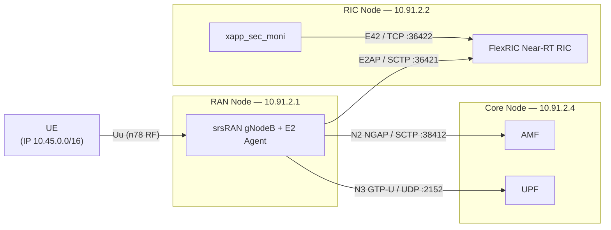
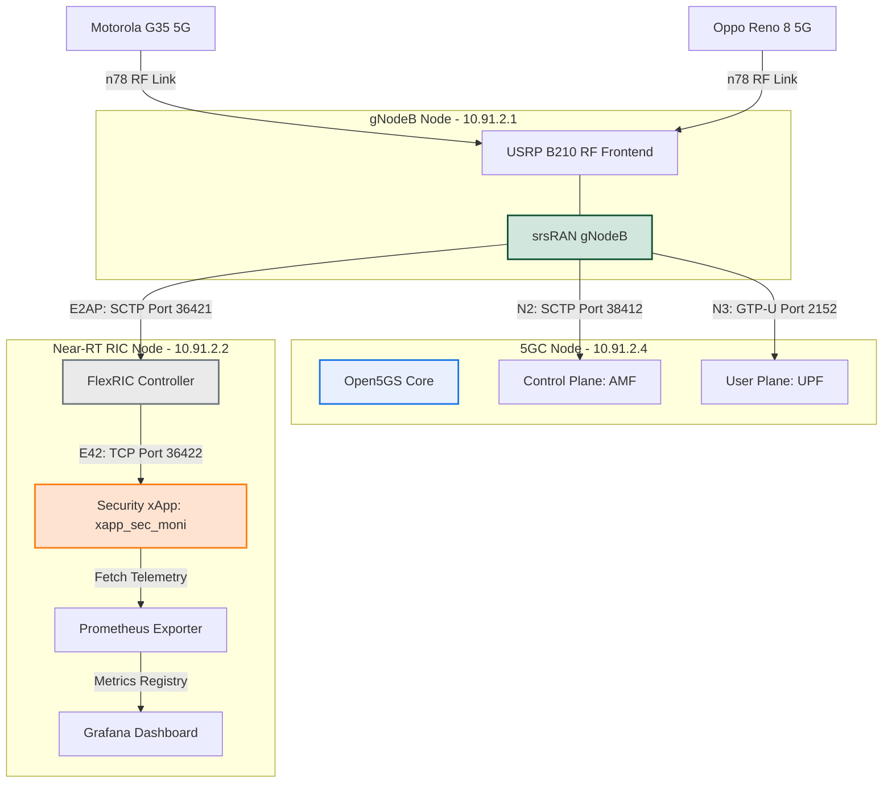
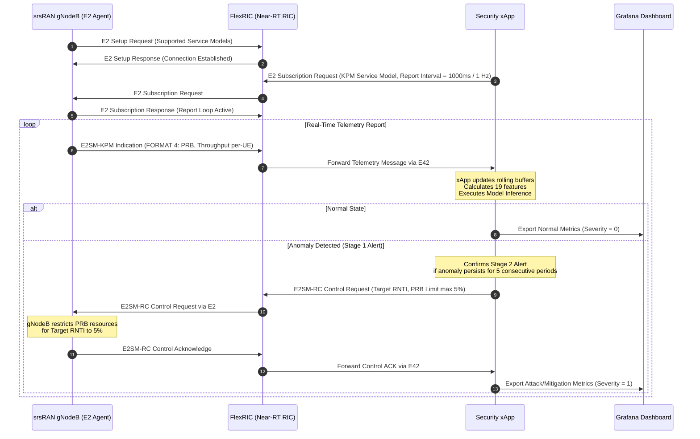
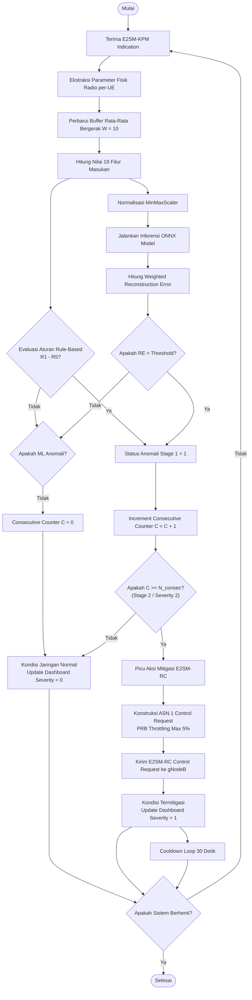

# BAB III — Source of Truth: Cuplikan Kode & Diagram

Berkas ini mengumpulkan **seluruh cuplikan kode dan diagram** yang dipakai di [BAB3.md](BAB3.md)
sebagai satu *source of truth*. Setiap cuplikan telah diverifikasi terhadap implementasi
nyata (kode ter-deploy di node + konfigurasi aktual node testbed, per 2026-06-28).

> Jika BAB3.md dan berkas ini berbeda, **berkas inilah acuannya** — perbarui BAB3.md agar
> selaras. Cuplikan kode bersifat representatif (disederhanakan agar terbaca); kolom
> "Sumber asli" menunjuk berkas penuh yang menjadi rujukan.

## Peta cuplikan → berkas sumber asli

| # | Cuplikan | Gambar / Bagian BAB3 | Sumber asli |
|---|---|---|---|
| 0 | Konfigurasi IP & topologi jaringan | §3.1.1 | konfigurasi node (RAN/RIC/Core) |
| 1 | Arsitektur fungsional (mermaid) | Gambar 3.1 | — (topologi testbed) |
| 2 | Diagram urutan loop tertutup (mermaid) | Gambar 3.2 | — |
| 3 | Blok diagram LSTM-AE (ASCII) | Gambar 3.3 | `src/detection/lstm_autoencoder.py` |
| 4 | Blok diagram GRU-AE (ASCII) | Gambar 3.4 | `src/detection/gru_autoencoder.py` |
| 5 | Diagram alir hibrida + mitigasi (mermaid) | Gambar 3.5 | `…/monitor/sec_ids_ue.c` |
| 6 | Konfigurasi gNodeB (YAML) | §3.2.1.A | `…/Next_Generation_Node_B/configs/cots_n78_copied.yml` (node RAN 10.91.2.1) |
| 7 | Konfigurasi SMF Open5GS (YAML) | §3.2.1.B | `~/core/config/smf.yaml` (node Core 10.91.2.4) |
| 8 | Trigger E2SM-RC (C) | §3.2.1.2 | `…/monitor/xapp_sec_mitigate.c` |
| 9 | Definisi model LSTM-AE (Python) | §3.2.2.1 | `src/detection/lstm_autoencoder.py` |
| 10 | Ekspor ONNX LSTM (Python) | §3.2.2.1 | `export_onnx_ue.py` |
| 11 | Definisi model GRU-AE (Python) | §3.2.2.2 | `src/detection/gru_autoencoder.py` |
| 12 | Ekspor ONNX GRU (Python) | §3.2.2.2 | `export_onnx_ue.py --arch gru` |
| 13 | Inisialisasi ONNX Runtime C API (C) | §3.2.2.3 | `…/monitor/sec_ids_ue.c` |
| 14 | Loop inferensi ONNX (C) | §3.2.2.3 | `…/monitor/sec_ids_ue.c` |
| 15 | Decision engine hibrida (C) | §3.2.2.3 | `…/monitor/sec_ids_ue.c` (`decision_engine_ue`) |
| 16 | CSV logger per-UE (C) | §3.2.3.1 | `…/monitor/xapp_sec_moni.c` (`csv_per_ue_write`) |

Prefiks `…/monitor/` = `/home/telmat/flexric/examples/xApp/c/monitor/`.

---

## 0. Konfigurasi IP & Topologi Jaringan

Testbed memakai dua segmen jaringan terpisah:

| Segmen | Subnet | Fungsi | Sumber asli |
|---|---|---|---|
| LAN backhaul (E2/N2/N3/manajemen) | `10.91.2.0/24` | Interkoneksi Core–RAN–RIC via Gigabit Ethernet | konfigurasi node |
| Data Network UE (`ogstun`) | `10.45.0.0/16` (IPv4) · `2001:db8:cafe::/48` (IPv6) | IP pool UE, DNN `internet` | `~/core/config/{smf,upf}.yaml` |

### 0.1 Alamat IP node

| Node | Peran | IP (`10.91.2.0/24`) | Software |
|---|---|---|---|
| RAN | gNodeB + E2 Agent (srsRAN) | `10.91.2.1` | srsRAN Project |
| RIC | Near-RT RIC + xApp + Exporter + Grafana | `10.91.2.2` | FlexRIC |
| Core | 5GC (AMF/SMF/UPF) | `10.91.2.4` | Open5GS |
| UE | Terminal pengguna | `10.45.0.0/16` (via DHCP/SMF) | Oppo Reno 8 5G, Motorola G35 5G |

> Antarmuka layanan internal Open5GS (SBI, PFCP, NRF, dll.) memakai alamat **loopback**
> `127.0.0.x`; hanya N2 (NGAP) dan N3 (GTP-U) yang di-*bind* ke `10.91.2.4`.

### 0.2 Antarmuka & port

| Antarmuka | Transport | Arah | Endpoint | Port | Sumber asli |
|---|---|---|---|---|---|
| **E2AP** | SCTP | gNB (DU) → RIC | `10.91.2.2` | `36421` | `cots_n78_copied.yml` (`e2.addr/port`) |
| **E42** | TCP | xApp → RIC | `10.91.2.2` | `36422` | `my_xapp_kpm.conf` (`NearRT_RIC_IP`, `E42_Port`) |
| **N2 (NGAP)** | SCTP | gNB → AMF | `10.91.2.4` | `38412` | `cots_n78_copied.yml` (`amf.addr/port`), `amf.yaml` (`ngap`) |
| **N3 (GTP-U)** | UDP | gNB → UPF | `10.91.2.4` | `2152` | `upf.yaml` (`gtpu.address`) |
| **SBI** | HTTP | internal 5GC | `127.0.0.x` | `7777` | `smf.yaml`/`amf.yaml` (loopback) |

### 0.3 Identitas PLMN & slice

| Parameter | Nilai | Sumber asli |
|---|---|---|
| PLMN ID | `00101` (MCC `001` / MNC `01`) | `cots_n78_copied.yml` (`plmn`), `amf.yaml` (`guami`) |
| TAC | `7` | `cots_n78_copied.yml` (`tac`), `amf.yaml` |
| S-NSSAI | SST `1` (eMBB) | `amf.yaml` (`plmn_support`), `xapp_sec_mitigate.c` (`--sst 1`) |
| PCI | `1` | `cots_n78_copied.yml` (`pci`) |
| Nama AMF | `open5gs-amf0` | `amf.yaml` (`amf_name`) |

### 0.4 Topologi koneksi (mermaid)



---

## 1. Gambar 3.1 — Arsitektur Fungsional Sistem (mermaid)



---

## 2. Gambar 3.2 — Diagram Urutan Loop Tertutup (mermaid)



---

## 3. Gambar 3.3 — Blok Diagram Arsitektur LSTM-Autoencoder (ASCII)

```
              [ Input Matrix (30 x 19) — fitur mentah ]
                                │
                                ▼
                 [ MinMaxScaler (baked-in ONNX) ]
                                │
                                ▼
              [ Encoder: LSTM Layer 1 (64 units, 1 arah) ]
                                │
                                ▼
              [ Encoder: LSTM Layer 2 (32 units, 1 arah) ]
                                │
                                ▼
            [ Temporal Attention (bobot antar-timestep) ]
                                │
                                ▼
              [ Dense → Latent Vector z (32) ]
                                │
                                ▼
        [ Dense Proyeksi (32) + Repeat Vector (x 30 steps) ]
                                │
                                ▼
              [ Decoder: LSTM Layer 1 (64 units) ]
                                │
                                ▼
              [ Decoder: LSTM Layer 2 (19 units) ]
                                │
                                ▼
              [ Reconstructed Matrix (30 x 19) ]
                                │
                                ▼
      [ Weighted MSE (Scheme A) → skalar RE (baked-in ONNX) ]
```

---

## 4. Gambar 3.4 — Blok Diagram Arsitektur GRU-Autoencoder (ASCII)

```
              [ Input Matrix (30 x 19) — fitur mentah ]
                                │
                                ▼
                 [ MinMaxScaler (baked-in ONNX) ]
                                │
                                ▼
          [ Encoder: BiGRU Layer 1 (hidden 64, 2 arah) ]
                                │
                                ▼
          [ Encoder: BiGRU Layer 2 (hidden 32, 2 arah) ]
                                │
                                ▼
            [ Temporal Attention (bobot antar-timestep) ]
                                │
                                ▼
              [ Dense → Latent Vector z (32) ]
                                │
                                ▼
        [ Dense Proyeksi (32) + Repeat Vector (x 30 steps) ]
                                │
                                ▼
          [ Decoder: GRU Layer 1 (64 units, 1 arah) ]
                                │
                                ▼
          [ Decoder: GRU Layer 2 (19 units, 1 arah) ]
                                │
                                ▼
              [ Reconstructed Matrix (30 x 19) ]
                                │
                                ▼
      [ Weighted MSE (Scheme A) → skalar RE (baked-in ONNX) ]
```

---

## 5. Gambar 3.5 — Diagram Alir Logika Deteksi Hibrida & Mitigasi (mermaid)



---

## 6. Konfigurasi gNodeB — `cots_n78_copied.yml` (node RAN 10.91.2.1)

```yaml
# cots_n78_copied.yml - Konfigurasi gNodeB & E2 Agent srsRAN
amf:
  addr: 10.91.2.4          # AMF (Core Node)
  port: 38412              # N2 (NGAP/SCTP)
  bind_addr: 10.91.2.1

ru_sdr:
  device_driver: uhd
  device_args: type=b200   # Ettus USRP B210
  srate: 46.08
  tx_gain: 80
  rx_gain: 40

cell_cfg:
  dl_arfcn: 627340         # Pita n78
  band: 78
  channel_bandwidth_MHz: 40
  common_scs: 30           # Subcarrier spacing 30 kHz
  plmn: '00101'            # MCC 001 / MNC 01
  tac: 7
  pci: 1

e2:
  enable_du_e2: true
  e2sm_kpm_enabled: true
  e2sm_rc_enabled: true    # wajib aktif untuk mitigasi E2SM-RC
  addr: 10.91.2.2          # Near-RT RIC
  port: 36421              # E2AP (SCTP)
  bind_addr: 10.91.2.1
```

> ⚠️ **Catatan verifikasi:** berkas nyata di node RAN saat audit berisi
> `e2sm_rc_enabled: false`. Untuk menjalankan demo mitigasi E2SM-RC, field ini
> **harus diset `true`** di node sebelum menjalankan `start_xapp_c_mitigate.sh`.

---

## 7. Konfigurasi SMF Open5GS — `smf.yaml` (node Core 10.91.2.4)

```yaml
# smf.yaml - Konfigurasi SMF Open5GS (Core Node)
smf:
  sbi:
    - address: 127.0.0.4   # SBI internal Open5GS (loopback)
      port: 7777
  pfcp:
    - address: 127.0.0.4
  gtpu:
    - address: 127.0.0.4
  session:
    - subnet: 10.45.0.0/16     # Alokasi IP Pool untuk UE (DNN: internet)
    - subnet: 2001:db8:cafe::/48
```

---

## 8. Trigger Mitigasi E2SM-RC — `xapp_sec_mitigate.c`

```c
// xapp_sec_mitigate.c - E2SM-RC Control Trigger (Style 2 / Action 6)
// Membatasi alokasi PRB (RRM Policy Ratio) untuk UE target.

// Control Header (Format 1): Style 2, Action 6, UE ID = gNB-DU F1AP
static e2sm_rc_ctrl_hdr_frmt_1_t build_ctrl_hdr(void) {
    e2sm_rc_ctrl_hdr_frmt_1_t hdr = {0};
    hdr.ric_style_type = 2;   // Style 2: Radio Resource Allocation Control
    hdr.ctrl_act_id    = 6;   // Action 6: PRB Quota / RRM Policy
    hdr.ue_id.type     = GNB_DU_UE_ID_E2SM;
    hdr.ue_id.gnb_du.gnb_cu_ue_f1ap = g_ue_f1ap;
    return hdr;
}

// Eksekusi: kirim Control Request berisi RRM Policy Ratio (max PRB = max_prb%)
static int execute_rc_control(int max_prb) {
    rc_ctrl_req_data_t rc_ctrl = {0};
    rc_ctrl.hdr.format = FORMAT_1_E2SM_RC_CTRL_HDR;
    rc_ctrl.hdr.frmt_1 = build_ctrl_hdr();
    rc_ctrl.msg.format = FORMAT_1_E2SM_RC_CTRL_MSG;
    rc_ctrl.msg.frmt_1 = build_ctrl_msg(max_prb);  // RRM Policy: min=0, max=ded=max_prb

    control_sm_xapp_api(&g_du_node_id, g_rc_rf_id, &rc_ctrl);
    free_rc_ctrl_req_data(&rc_ctrl);
    printf("[MITIGATE] E2SM-RC sent: max_prb=%d%%\n", max_prb);  // throttle=5, restore=100
    return 1;
}
```

---

## 9. Definisi Model LSTM-Autoencoder — `lstm_autoencoder.py`

```python
# lstm_autoencoder.py - PyTorch Model Definition
import torch
import torch.nn as nn

class TemporalAttention(nn.Module):
    """Self-attention antar-timestep: memberi bobot lebih pada timestep anomalous."""
    def __init__(self, hidden_dim):
        super().__init__()
        self.attn = nn.Linear(hidden_dim, 1)
    def forward(self, out):                                   # (B, T, H)
        w = torch.softmax(self.attn(out).squeeze(-1), dim=1).unsqueeze(-1)
        return (out * w).sum(dim=1)                           # (B, H)

class LSTMEncoder(nn.Module):
    def __init__(self, no_features, hidden=[64, 32], latent_dim=32):
        super().__init__()
        # LSTM unidirectional (bidirectional=False untuk model LSTM-AE)
        self.lstm1 = nn.LSTM(no_features, hidden[0], batch_first=True)
        self.lstm2 = nn.LSTM(hidden[0],   hidden[1], batch_first=True)
        self.attention = TemporalAttention(hidden[1])
        self.fc = nn.Linear(hidden[1], latent_dim)
    def forward(self, x):
        out, _ = self.lstm1(x)
        out, _ = self.lstm2(out)
        return self.fc(self.attention(out))                  # (B, latent_dim)

class LSTMDecoder(nn.Module):
    def __init__(self, latent_dim=32, hidden=[32, 64], no_features=19, seq_len=30):
        super().__init__()
        self.seq_len = seq_len
        self.fc = nn.Linear(latent_dim, hidden[0])
        self.lstm1 = nn.LSTM(hidden[0], hidden[1],   batch_first=True)
        self.lstm2 = nn.LSTM(hidden[1], no_features, batch_first=True)
    def forward(self, z):
        h = self.fc(z).unsqueeze(1).repeat(1, self.seq_len, 1)  # proyeksi + repeat x30
        out, _ = self.lstm1(h)
        out, _ = self.lstm2(out)
        return out                                           # (B, seq_len, no_features)

class LSTMAutoencoder(nn.Module):
    def __init__(self, seq_len=30, no_features=19, latent_dim=32):
        super().__init__()
        self.encoder = LSTMEncoder(no_features, [64, 32], latent_dim)
        self.decoder = LSTMDecoder(latent_dim, [32, 64], no_features, seq_len)
    def forward(self, x):
        return self.decoder(self.encoder(x))
```

---

## 10. Ekspor ONNX LSTM-AE — `export_onnx_ue.py`

```python
# export_onnx_ue.py - Bake MinMaxScaler + Weighted MSE (Scheme A) ke dalam ONNX
import torch, pickle
import torch.nn as nn
from src.detection.lstm_autoencoder import LSTMAutoencoder
from src.detection.feature_schema_ue import FEATURE_WEIGHTS, FEATURE_NAMES

class ONNXPerUEWrapper(nn.Module):
    """Input: fitur mentah [B,30,19] → Output: skalar Weighted MSE (node 'mse')."""
    def __init__(self, model, scaler, weights):
        super().__init__()
        self.model = model
        self.a = nn.Parameter(torch.tensor(scaler.scale_, dtype=torch.float32), requires_grad=False)
        self.b = nn.Parameter(torch.tensor(scaler.min_,   dtype=torch.float32), requires_grad=False)
        self.w = nn.Parameter(weights / weights.sum(), requires_grad=False)  # Scheme A ternormalisasi

    def forward(self, x):
        x = x * self.a + self.b                 # MinMaxScaler
        recon = self.model(x)
        fe = ((x - recon) ** 2).mean(dim=1)     # rata-rata 30 timestep -> [B, 19]
        return (fe * self.w).sum(dim=-1)        # Weighted MSE skalar -> [B]

model = LSTMAutoencoder(seq_len=30, no_features=19, latent_dim=32)
model.load_state_dict(torch.load("models/lstm_ue_v4.pt", map_location="cpu")["model_state_dict"])
scaler  = pickle.load(open("models/lstm_ue_v4_scaler.pkl", "rb"))
weights = torch.tensor([FEATURE_WEIGHTS[n] for n in FEATURE_NAMES])
wrapped = ONNXPerUEWrapper(model.eval(), scaler, weights).eval()

torch.onnx.export(
    wrapped, torch.zeros(1, 30, 19), "models/lstm_ue_v4.onnx",
    opset_version=14, do_constant_folding=True,
    input_names=["input"], output_names=["mse"],
    dynamic_axes={"input": {0: "batch"}, "mse": {0: "batch"}},
)
print("Model LSTM-AE (scaler + weighted MSE) berhasil diekspor ke ONNX.")
```

---

## 11. Definisi Model GRU-Autoencoder — `gru_autoencoder.py`

```python
# gru_autoencoder.py - PyTorch Model Definition
import torch
import torch.nn as nn
from src.detection.lstm_autoencoder import TemporalAttention

class GRUEncoder(nn.Module):
    def __init__(self, no_features, hidden=[64, 32], latent_dim=32, bidirectional=True):
        super().__init__()
        D = 2 if bidirectional else 1            # BiGRU: tiap layer keluaran hidden*2
        self.gru1 = nn.GRU(no_features,  hidden[0], batch_first=True, bidirectional=bidirectional)
        self.gru2 = nn.GRU(hidden[0]*D,  hidden[1], batch_first=True, bidirectional=bidirectional)
        self.attention = TemporalAttention(hidden[1]*D)
        self.fc = nn.Linear(hidden[1]*D, latent_dim)
    def forward(self, x):
        out, _ = self.gru1(x)
        out, _ = self.gru2(out)
        return self.fc(self.attention(out))      # (B, latent_dim)

class GRUDecoder(nn.Module):                     # unidirectional
    def __init__(self, latent_dim=32, hidden=[32, 64], no_features=19, seq_len=30):
        super().__init__()
        self.seq_len = seq_len
        self.fc = nn.Linear(latent_dim, hidden[0])
        self.gru1 = nn.GRU(hidden[0], hidden[1],   batch_first=True)
        self.gru2 = nn.GRU(hidden[1], no_features, batch_first=True)
    def forward(self, z):
        h = self.fc(z).unsqueeze(1).repeat(1, self.seq_len, 1)
        out, _ = self.gru1(h)
        out, _ = self.gru2(out)
        return out

class GRUAutoencoder(nn.Module):
    def __init__(self, seq_len=30, no_features=19, latent_dim=32):
        super().__init__()
        self.encoder = GRUEncoder(no_features, [64, 32], latent_dim, bidirectional=True)
        self.decoder = GRUDecoder(latent_dim, [32, 64], no_features, seq_len)
    def forward(self, x):
        return self.decoder(self.encoder(x))
```

---

## 12. Ekspor ONNX GRU-AE — `export_onnx_ue.py --arch gru`

```python
# export_onnx_ue.py --arch gru : ekspor GRU-AE dengan wrapper yang sama
import torch, pickle
from src.detection.gru_autoencoder import GRUAutoencoder
from src.detection.feature_schema_ue import FEATURE_WEIGHTS, FEATURE_NAMES
# ONNXPerUEWrapper identik dengan ekspor LSTM (scaler + Weighted MSE -> skalar "mse")

model = GRUAutoencoder(seq_len=30, no_features=19, latent_dim=32)
model.load_state_dict(torch.load("models/gru_ue_v4.pt", map_location="cpu")["model_state_dict"])
scaler  = pickle.load(open("models/gru_ue_v4_scaler.pkl", "rb"))
weights = torch.tensor([FEATURE_WEIGHTS[n] for n in FEATURE_NAMES])
wrapped = ONNXPerUEWrapper(model.eval(), scaler, weights).eval()

torch.onnx.export(
    wrapped, torch.zeros(1, 30, 19), "models/gru_ue_v4.onnx",
    opset_version=14, do_constant_folding=True,
    input_names=["input"], output_names=["mse"],
    dynamic_axes={"input": {0: "batch"}, "mse": {0: "batch"}},
)
print("Model GRU-AE (scaler + weighted MSE) berhasil diekspor ke ONNX.")
```

---

## 13. Inisialisasi ONNX Runtime C API — `sec_ids_ue.c`

```c
// sec_ids_ue.c - ONNX Runtime C API Initialization
#include <onnxruntime_c_api.h>
#include "sec_ids_ue.h"

OrtEnv* g_ort_env = NULL;
OrtSession* g_ort_session = NULL;
OrtSessionOptions* g_session_options = NULL;
OrtMemoryInfo* g_memory_info = NULL;

int init_onnx_runtime(const char* model_path) {
    const OrtApi* g_ort = OrtGetApiBase()->GetApi(ORT_API_VERSION);
    if (!g_ort) return -1;

    // Inisialisasi Environment ONNX
    g_ort->CreateEnv(ORT_LOGGING_LEVEL_WARNING, "SecurityxAppEnv", &g_ort_env);
    g_ort->CreateSessionOptions(&g_session_options);
    g_ort->SetSessionOptionsCpuMemArenaState(g_session_options, 1);

    // Buat Session Baru
    OrtStatus* status = g_ort->CreateSession(g_ort_env, model_path, g_session_options, &g_ort_session);
    if (status != NULL) {
        g_ort->ReleaseStatus(status);
        return -1;
    }

    g_ort->CreateCpuMemoryInfo(OrtArenaAllocator, OrtMemTypeDefault, &g_memory_info);
    return 0; // Inisialisasi Sukses
}
```

---

## 14. Loop Inferensi ONNX (keluaran skalar `mse`) — `sec_ids_ue.c`

```c
// sec_ids_ue.c - ONNX Inference Loop (keluaran skalar "mse")
// MinMaxScaler + Weighted MSE (Scheme A) sudah dibakukan di dalam ONNX,
// sehingga keluaran model langsung berupa skalar Reconstruction Error.

float run_inference_ue(const float* input_30x19) {
    const OrtApi* g_ort = OrtGetApiBase()->GetApi(ORT_API_VERSION);

    // Tensor masukan fitur mentah [1, 30, 19]
    int64_t input_shape[3] = {1, 30, 19};
    size_t input_size = 1 * 30 * 19 * sizeof(float);

    OrtValue* input_tensor = NULL;
    g_ort->CreateTensorWithDataAsOrtValue(
        g_memory_info, (void*)input_30x19, input_size,
        input_shape, 3, ONNX_TENSOR_ELEMENT_DATA_TYPE_FLOAT, &input_tensor);

    const char* input_names[]  = {"input"};
    const char* output_names[] = {"mse"};   // node keluaran skalar
    OrtValue* output_tensor = NULL;

    // Jalankan inferensi (LSTM-AE atau GRU-AE — layout identik)
    g_ort->Run(g_ort_session, NULL, input_names,
               (const OrtValue**)&input_tensor, 1,
               output_names, 1, &output_tensor);

    // Baca skalar Reconstruction Error langsung dari keluaran ONNX
    float* output_data = NULL;
    g_ort->GetTensorMutableData(output_tensor, (void**)&output_data);
    float re = output_data[0];   // Weighted MSE rata-rata 30 timestep

    g_ort->ReleaseValue(input_tensor);
    g_ort->ReleaseValue(output_tensor);
    return re;                    // dibandingkan dengan threshold di decision_engine_ue()
}
```

---

## 15. Decision Engine Hibrida — `sec_ids_ue.c` (`decision_engine_ue`)

```c
// sec_ids_ue.c - Decision Engine Implementation
#include <string.h>
#include "sec_ids_ue.h"

int decision_engine_ue(const char* ids_mode, float re_score, int rule_triggered) {
    float threshold = 0.025266; // Batas Ambang Batas Default untuk LSTM-AE
    if (strcmp(ids_mode, "gru-hybrid") == 0 || strcmp(ids_mode, "gru-only") == 0) {
        threshold = 0.025969; // Batas Ambang Batas untuk GRU-AE
    }

    int ml_triggered = (re_score > threshold) ? 1 : 0;

    if (strcmp(ids_mode, "rule-only") == 0) {
        return rule_triggered;
    } else if (strcmp(ids_mode, "lstm-only") == 0 || strcmp(ids_mode, "gru-only") == 0) {
        return ml_triggered;
    } else if (strcmp(ids_mode, "lstm-hybrid") == 0 || strcmp(ids_mode, "gru-hybrid") == 0) {
        // Logika Penggabungan Hibrida Paralel: Rule OR ML (Rule ∪ ML)
        return (rule_triggered || ml_triggered) ? 1 : 0;
    }

    return 0; // Normal
}
```

---

## 16. CSV Logger Per-UE — `xapp_sec_moni.c`

```c
// xapp_sec_moni.c - Per-UE Alert CSV Logger
// Header: timestamp_ms,rnti,rule_mask,rule_stage,mse,threshold,alert_type
#include <stdio.h>

void csv_alert_write(FILE* fp, long long ts_ms, uint16_t rnti,
                     uint32_t rule_mask, int rule_stage,
                     float mse, float threshold, const char* alert_type) {
    if (!fp) return;
    fprintf(fp, "%lld,%u,%u,%d,%.6f,%.6f,%s\n",
            ts_ms, rnti, rule_mask, rule_stage, mse, threshold, alert_type);
    fflush(fp);   // tulis langsung (append) ke berkas
}
```

---

## Lampiran — Nilai-nilai acuan (constants of truth)

| Parameter | Nilai | Sumber asli |
|---|---|---|
| Jumlah fitur per-UE | 19 (15 base + 4 burst index) | `src/detection/feature_schema_ue.py` (`NUM_FEATURES`) |
| Panjang window ($T$) | 30 sampel | `…/monitor/sec_ids_ue.h` (`ML_SEQ_LEN`) |
| Laju pelaporan KPM | 1000 ms (1 Hz) | `my_xapp_kpm.conf` (`time = 1000`) |
| Memori temporal | 30 detik (30 × 1 s) | `ML_SEQ_LEN` comment |
| Format KPM | FORMAT 4 | `my_xapp_kpm.conf` (`format = 4`) |
| Threshold LSTM-AE (P97) | 0.025266 | `models/lstm_ue_v4_threshold.json` |
| Threshold GRU-AE (P97) | 0.025969 | `models/gru_ue_v4_threshold.json` |
| FPR validasi (kedua model) | 3.05% | `models/*_ue_v4_threshold.json` |
| Mitigasi E2SM-RC | Style 2, Action 6 | `…/monitor/xapp_sec_mitigate.c` |
| Throttle / Restore PRB | 5% / 100% | `…/monitor/xapp_sec_mitigate.c` |
| Cooldown | 30 detik | `…/monitor/xapp_sec_moni.c` (`THROTTLE_COOLDOWN_MS = 30000`) |
| Rule R1–R5 (ambang, N_consec) | 15000/0.70/5 · 15000/0.85/5 · 0.12/0.05/5 · 0.90/0.50/10 · 0.30/5000/3 | `…/monitor/sec_ids_ue.c` (`R1_*`–`R5_*`) |
| Severity | R1–R3 = 1 (warning), R4–R5 = 2 (critical) | `…/monitor/sec_ids_ue.h` |
| ONNX opset | 14 | `export_onnx_ue.py` |
| Metrik Prometheus | `xapp_ue_mse`, `xapp_ue_alert_type`, `xapp_ue_stage`, … | `exporter/csv_exporter.py` |

**Spesifikasi node testbed (Ubuntu 24.04.4 LTS, Gigabit Ethernet):**

| Node | IP | CPU | Core | RAM |
|---|---|---|---|---|
| RAN (gNodeB) | 10.91.2.1 | Intel Core i5-6500 @3.20GHz | 4 | 32 GB |
| Near-RT RIC | 10.91.2.2 | Intel Core i5-7500 @3.40GHz | 4 | 32 GB |
| 5G Core | 10.91.2.4 | Intel Core i5-8500T @2.10GHz | 6 | 32 GB |
