# BAB III DETIL DESAIN DAN IMPLEMENTASI

## 3.1 Model Desain

Penyusunan bab ini diawali dengan perancangan model desain sistem yang memetakan seluruh unit logis, hubungan antarkomponen, serta pembagian fungsionalitas rekayasa. Sistem diimplementasikan pada lingkungan testbed fisik multi-node berskala lokal di Laboratorium Telematika. Perancangan model deteksi anomali mencakup dua model deteksi berbasis pembelajaran mendalam temporal, yaitu model **LSTM-Autoencoder**, serta logika penapisan aturan (*Rule-Based*) yang digabungkan ke dalam bentuk sistem deteksi hibrida paralel. Pengujian dilakukan dengan mengevaluasi kemampuan *security xApp* dalam mendeteksi dan menangkal serangan *Denial of Service* (DoS) menggunakan metode deteksi tersebut. Parameter yang menjadi acuan dalam melakukan pengukuran performa sistem adalah *Recall*, *F1-score*, *False Positive Rate* (FPR), latensi deteksi, dan latensi mitigasi.

---

### 3.1.1 Pemodelan Sistem Terintegrasi

Sebelum menjabarkan detail fungsionalitas per-subsistem, bagian ini menyajikan arsitektur dan interaksi sistem secara keseluruhan (*integrated system*). Sistem ini dirancang untuk berjalan sebagai loop kontrol tertutup (*closed-loop control*) yang mengintegrasikan gNodeB (sebagai E2 Node), platform Near-RT RIC, serta program C-native *security xApp* yang mencakup modul penapisan aturan dan mesin kecerdasan buatan.

Uji coba sistem diwujudkan pada jaringan testbed fisik multi-node berskala lokal di Laboratorium Telematika. Rancangan topologi jaringan memisahkan beban komputasi gNodeB, Near-RT RIC, dan 5G Core Network ke dalam tiga unit fisik PC server yang berbeda. Pemisahan fisik ini krusial untuk menyimulasikan karakteristik penundaan transmisi (*transmission delay*) dan latensi pemrosesan pada jaringan seluler komersial yang sesungguhnya. Topologi fisik dan segmentasi alamat IP antar-node dirancang pada subnet Local Area Network (LAN) `10.91.2.0/24` seperti digambarkan pada Gambar 3.1.

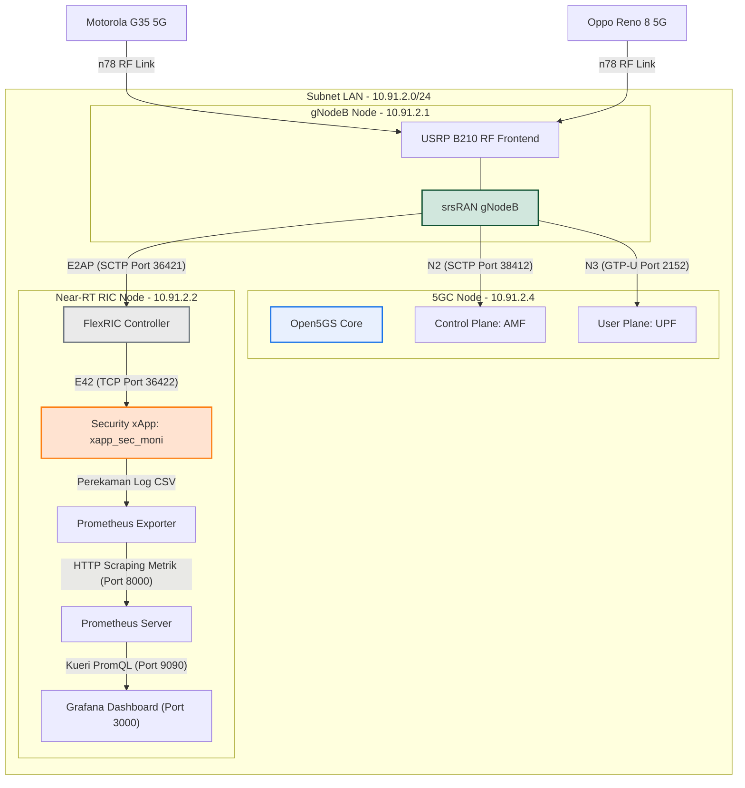
<p align="center">Gambar 3.1 Rancangan Topologi Jaringan Multi-Node Testbed 5G-SA O-RAN</p>

RAN Node (IP `10.91.2.1`) bertindak sebagai node radio akses (gNodeB) yang memancarkan sinyal nirkabel n78 menggunakan Ettus USRP B210. Pada node ini berjalan srsRAN Project yang secara native memuat agen E2AP internal. Hubungan ke 5G Core Network di Core Node (IP `10.91.2.4`) diakomodasi melalui antarmuka standardisasi 3GPP N2 (untuk persinyalan kontrol AMF via SCTP port 38412) dan antarmuka N3 (untuk aliran data pengguna UPF via GTP-U port 2152). Sementara itu, antarmuka kontrol O-RAN dihubungkan menuju RIC Node (IP `10.91.2.2`) menggunakan protokol E2AP berbasis SCTP melalui port 36421. Di dalam RIC Node, platform FlexRIC Near-RT RIC berkomunikasi dengan program C-native *Security-Related xApp* (`xapp_sec_moni`) secara lokal maupun internal melalui antarmuka E42 berbasis TCP port 36422. Pemisahan domain ini ke dalam tiga PC server bare-metal ditujukan untuk mengeliminasi perebutan sumber daya komputasi dan memastikan simulasi latensi transmisi fisik yang realistis, di mana komunikasi antar-node dibatasi pada segmentasi subnet LAN fisik menggunakan switch Gigabit Ethernet.

Alur data persinyalan dirancang untuk berjalan secara loop tertutup (*closed-loop control*) yang memadukan protokol O-RAN E2AP, model layanan E2SM-KPM, dan model layanan kontrol E2SM-RC. Alur data dan persinyalan asinkron antar-node ini digambarkan melalui diagram urutan pada Gambar 3.2.

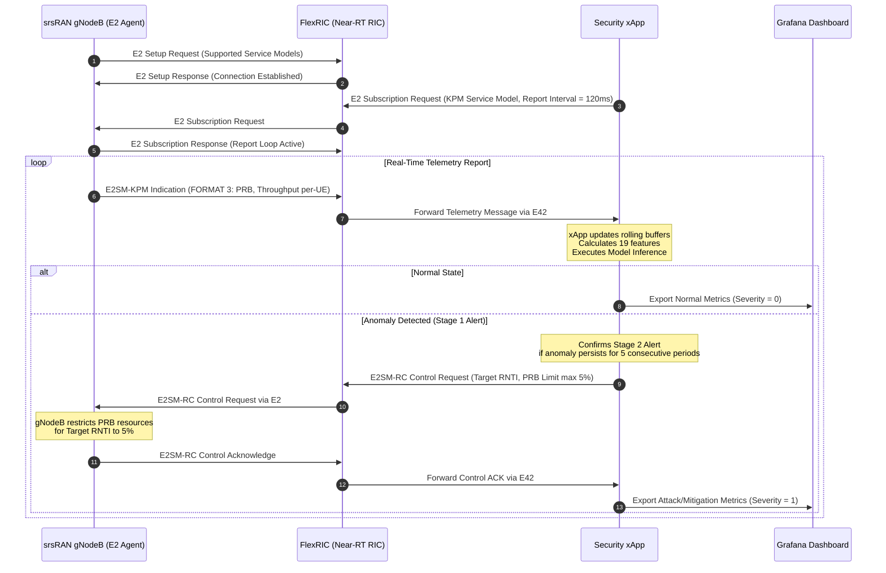
<p align="center">Gambar 3.2 Diagram Urutan Aliran Persinyalan dan Alur Data Antarmuka O-RAN E2</p>

Prosedur pertukaran informasi ini diawali dengan pengiriman pesan *E2 Setup Request* dari E2 Agent gNodeB ke RIC Controller untuk menegosiasikan daftar model layanan yang didukung. Setelah koneksi SCTP terjalin, xApp mengirimkan pesan *E2 Subscription Request* menuju RIC Controller, yang kemudian diteruskan ke gNodeB. Pesan ini menginstruksikan gNodeB untuk mengaktifkan pelaporan metrik berbasis E2SM-KPM Format 3 dengan interval periodik sebesar 120 ms. Pemilihan interval 120 ms ini didasarkan pada optimasi antara tingkat responsivitas deteksi temporal dengan batasan overhead komunikasi pada testbed. Pesan *E2SM-KPM Indication* dikirimkan secara kontinu dari gNodeB ke RIC, lalu diteruskan ke xApp melalui soket TCP antarmuka E42. xApp mengekstrak data metrik per-UE tersebut, menghitung 19 fitur masukan temporal, dan melakukan inferensi. Jika kondisi serangan DoS terkonfirmasi (berlangsung selama 5 periode pelaporan berturut-turut untuk mencegah alarm palsu akibat fluktuasi trafik sesaat), xApp memicu aksi mitigasi dengan mengirimkan pesan *E2SM-RC Control Request* yang meminta pembatasan alokasi Physical Resource Block (PRB) downlink/uplink untuk UE dengan RNTI tertentu maksimal sebesar 5%. Setelah gNodeB berhasil membatasi alokasi fisik PRB melalui penjadwal radio (*radio scheduler*), ia membalas dengan *E2SM-RC Control Acknowledge* untuk mengonfirmasi bahwa mitigasi telah aktif.

Untuk memodelkan hubungan fungsional antar-node secara logis dalam sistem deteksi dan mitigasi loop tertutup, dirancang blok diagram pemodelan fungsional sistem terintegrasi yang digambarkan pada Gambar 3.3. Blok diagram ini memperlihatkan interaksi antara E2 Agent gNodeB, FlexRIC Controller, serta modul-modul internal di dalam xApp.

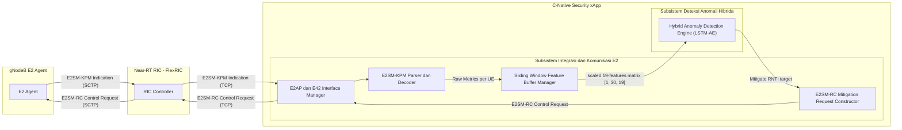
<p align="center">Gambar 3.3 Blok Diagram Pemodelan Fungsional Sistem Terintegrasi</p>

Sistem memadukan fungsionalitas pengumpulan telemetri radio nirkabel pada gNodeB, penerusan data secara real-time pada FlexRIC, pengolahan telemetri dan deteksi serangan di dalam program xApp, hingga penerbitan perintah pembatasan sumber daya radio gNodeB via protokol E2SM-RC. Hubungan timbal balik ini membentuk loop tertutup di mana aksi mitigasi secara otomatis disesuaikan berdasarkan kondisi fisik yang dirasakan oleh sensor radio. Secara fungsional, blok diagram ini memperlihatkan pemisahan batas sistem (*system boundary*) di mana data laporan indikasi ASN.1 didekode oleh parser untuk diubah menjadi matriks temporal tersemat di dalam buffer xApp, sebelum diumpankan ke modul kecerdasan buatan dan menghasilkan keputusan kontrol mitigasi yang dikirimkan kembali ke penjadwal radio gNodeB melalui agen FlexRIC.

Tingkah laku dinamis dari seluruh sistem dalam melakukan deteksi dan mitigasi loop tertutup dimodelkan secara terpadu melalui diagram alir (*flowchart*) sistem keseluruhan pada Gambar 3.4.

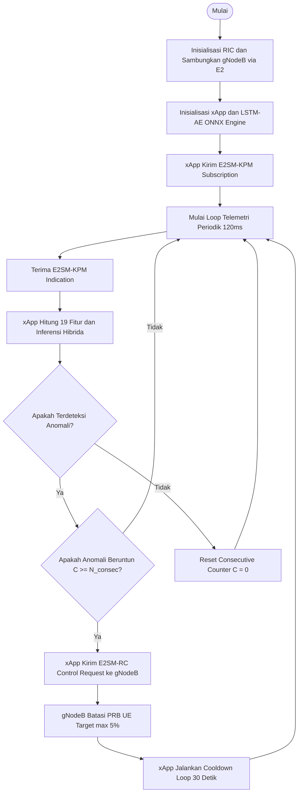
<p align="center">Gambar 3.4 Flowchart Pemodelan Tingkah Laku Sistem Terintegrasi</p>

Diagram alir sistem keseluruhan memperlihatkan daur hidup operasional sistem terintegrasi. Dimulai dari inisialisasi jaringan dan jabat tangan koneksi E2, dilanjutkan dengan proses pengumpulan metrik periodik oleh xApp. Apabila kondisi anomali terkonfirmasi secara persisten (beruntun selama $N_{\text{consec}} = 5$ periode pelaporan KPM), sinyal mitigasi akan dikeluarkan sehingga gNodeB membatasi alokasi PRB bagi UE penyerang maksimal 5%, sebelum xApp memasuki masa cooldown selama 30 detik untuk mencegah osilasi kontrol dan mengulangi siklus pemantauan berikutnya. Logika pengambilan keputusan ini memastikan bahwa fluktuasi trafik jangka pendek yang bersifat benign tidak memicu tindakan pembatasan alokasi frekuensi radio yang merugikan pengguna sah.

---

### 3.1.2 Subsistem Integrasi dan Komunikasi E2

Subsistem Integrasi dan Komunikasi E2 dirancang untuk memproses pertukaran data antarmuka O-RAN E2 secara langsung (*native*) pada lapisan perangkat lunak xApp menggunakan C-SDK FlexRIC tanpa mekanisme bypass.

Pemodelan fungsional dari Subsistem Integrasi dan Komunikasi E2 memisahkan secara tegas modul penerima metrik dengan modul pembangun perintah mitigasi seperti digambarkan pada Gambar 3.5.

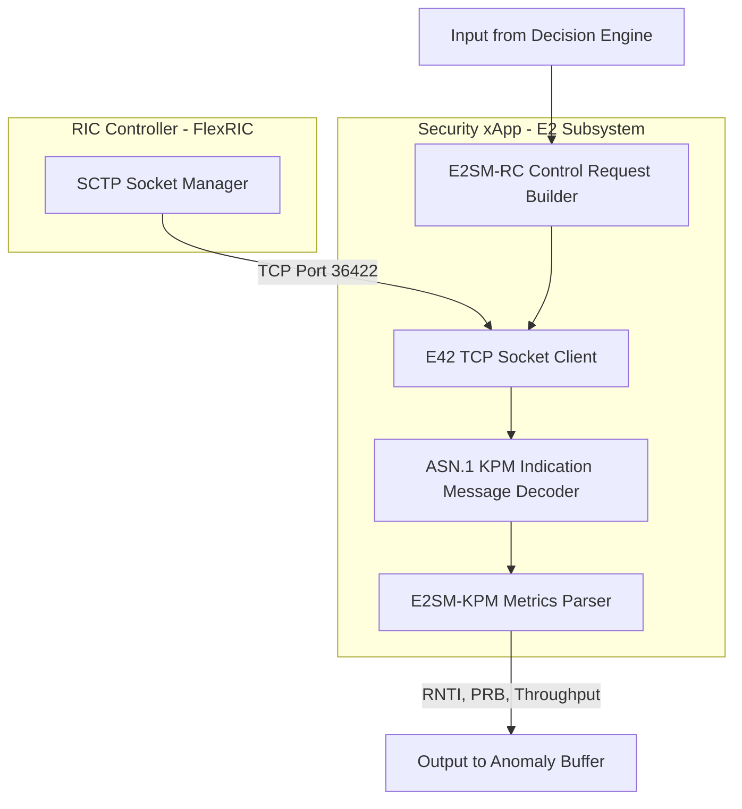
<p align="center">Gambar 3.5 Blok Diagram Pemodelan Fungsional Subsistem Integrasi dan Komunikasi E2</p>

Unit fungsional di dalam subsistem ini meliputi pemelihara koneksi socket (*E42 TCP Connection Client*), pengurai biner ASN.1 (*ASN.1 KPM Decoder*), pemilah parameter fisik radio (*E2SM-KPM Metrics Parser*), dan penyusun format instruksi kontrol radio (*E2SM-RC Builder*). Aliran data mengalir dari socket E42 menuju unit parser untuk diteruskan ke buffer, dan arah sebaliknya untuk perintah kontrol. Pemisahan fungsional ini memastikan modularitas tinggi di mana modul decoding ASN.1 dapat berjalan secara independen dari modul parser metrik KPM, sehingga perubahan skema fitur atau penambahan parameter radio baru di masa mendatang tidak mengganggu stabilitas interkoneksi soket TCP E42.

Tingkah laku logis Subsistem Integrasi dan Komunikasi E2 dalam memantau soket, menangani kegagalan jabat tangan subscription KPM, serta memproses decoding ASN.1 dimodelkan secara detail melalui diagram alir pada Gambar 3.6.

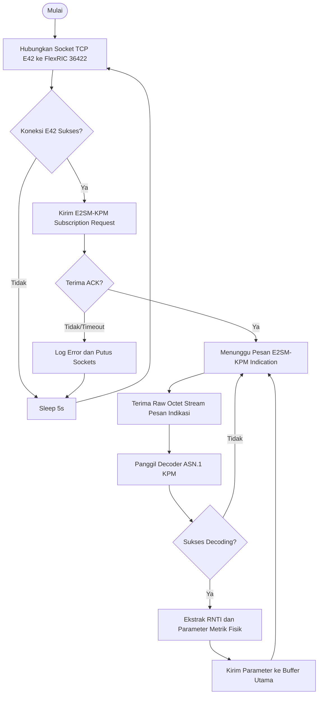
<p align="center">Gambar 3.6 Flowchart Pemodelan Tingkah Laku Subsistem Integrasi dan Komunikasi E2</p>

Flowchart ini memaparkan penanganan koneksi di mana sistem secara proaktif melakukan percobaan penyambungan ulang jika socket E42 terputus dengan jeda pendinginan selama 5 detik untuk menghindari beban kerja CPU yang berlebihan akibat loop kegagalan. Setelah terhubung dan berhasil melakukan negosiasi berlangganan metrik KPM, subsistem berulang kali memproses masuknya pesan indikasi, mendekode representasi biner ASN.1 menggunakan pustaka pengurai ASN.1 bawaan, memvalidasi hasil parsing, serta mengirimkan data ke memori buffer. Alur logis ini memastikan keandalan penanganan pengecualian (*exception handling*) ketika terjadi kegagalan dekode biner, di mana paket yang rusak akan diabaikan secara aman tanpa menghentikan thread pemantauan utama.

### 3.1.3 Subsistem Deteksi Anomali Hibrida

Subsistem Deteksi Anomali Hibrida dirancang untuk mendeteksi kondisi tidak biasa atau serangan DoS pada jaringan secara paralel dengan memadukan model *Machine Learning* temporal LSTM-Autoencoder dan penapisan aturan manual (*Rule-Based*).

Model LSTM-Autoencoder (LSTM-AE) merupakan model deteksi anomali tanpa pengawasan (*unsupervised*) yang memproses data metrik temporal per-UE dengan panjang window temporal ($T$) sebesar 30 sampel. Arsitektur model LSTM-AE dirancang dengan struktur *Encoder* dan *Decoder* simetris berbasis gerbang LSTM unidirectional. Blok diagram fungsional pemrosesan LSTM-AE digambarkan pada Gambar 3.7.

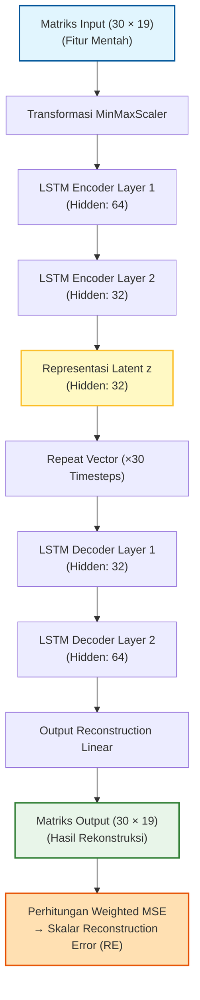
<p align="center">Gambar 3.7 Blok Diagram Fungsional Arsitektur Model LSTM-Autoencoder</p>

Blok diagram arsitektur model LSTM-Autoencoder menggambarkan alur kompresi dan rekonstruksi data temporal. Matriks masukan berukuran $30 \times 19$ dinormalisasi terlebih dahulu menggunakan transformator MinMaxScaler untuk menyamakan skala seluruh fitur fisik radio. Proses kompresi (*encoding*) dilakukan secara bertahap melalui LSTM Layer 1 (64 unit tersembunyi) dan LSTM Layer 2 (32 unit tersembunyi) untuk menangkap pola ketergantungan temporal jangka panjang, menghasilkan representasi laten $z$ berdimensi 32 yang memuat bottleneck informasi. Selanjutnya, vektor laten ini diproyeksikan dan diulangi sebanyak 30 kali (*Repeat Vector*) sebagai masukan bagi proses rekonstruksi (*decoding*) melalui LSTM Decoder Layer 1 (32 unit) dan LSTM Decoder Layer 2 (64 unit). Matriks keluaran hasil rekonstruksi kemudian dibandingkan dengan matriks masukan terdistorsi melalui perhitungan Weighted Mean Squared Error (MSE) untuk menghasilkan satu skalar Reconstruction Error (RE) akhir. Tingginya nilai RE menunjukkan penyimpangan pola lalu lintas yang signifikan terhadap baseline normal.

Untuk mengintegrasikan model pembelajaran mendalam dengan mesin penapisan aturan secara simultan, dirancang blok diagram pemodelan fungsional Subsistem Deteksi Anomali Hibrida seperti yang disajikan pada Gambar 3.8.

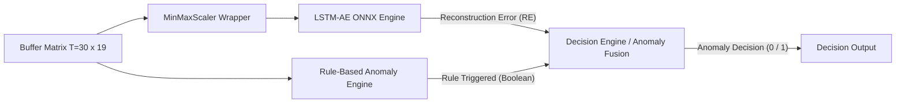
<p align="center">Gambar 3.8 Blok Diagram Pemodelan Fungsional Subsistem Deteksi Anomali Hibrida</p>

Blok diagram pemodelan fungsional ini memperlihatkan integrasi paralel antara metode berbasis kecerdasan buatan (*Machine Learning*) dengan mesin keputusan berbasis aturan (*Rule-Based*). Penyangga buffer temporal ($T=30$) menyuplai data metrik secara simultan ke MinMaxScaler sebelum diinferensi oleh engine ONNX LSTM-AE, serta ke *Rule-Based Anomaly Engine* untuk dievaluasi terhadap 5 aturan ambang batas fisik (R1–R5). Hasil keluaran berupa skor *Reconstruction Error* (RE) dan indikator boolean aturan terpicu digabungkan secara paralel di dalam *Decision Engine* (Anomaly Fusion) menggunakan operator logika OR (Rule $\cup$ ML) untuk menghasilkan keputusan status akhir yang deterministik.

Alur logika dan tingkah laku pemrosesan data di dalam Subsistem Deteksi Anomali Hibrida digambarkan melalui flowchart pada Gambar 3.9.

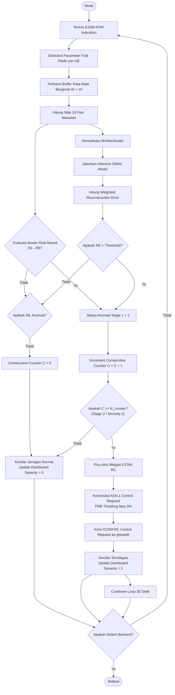
<p align="center">Gambar 3.9 Flowchart Pemodelan Tingkah Laku Subsistem Deteksi Anomali Hibrida</p>

Diagram alir tingkah laku subsistem deteksi anomali hibrida menggambarkan daur pemrosesan data sejak paket indikasi KPM diterima hingga aksi mitigasi dipicu. Pemrosesan paralel membagi data ke dalam evaluasi heuristik aturan fisik dan inferensi model ONNX. Jika salah satu atau kedua metode mendeteksi anomali, status anomali Stage 1 diaktifkan dan consecutive counter ($C$) ditingkatkan. Jika kondisi anomali berlangsung terus-menerus hingga mencapai batas $N_{\text{consec}} = 5$, status meningkat menjadi Stage 2 (kritis), memicu pengiriman pesan kontrol mitigasi E2SM-RC ke gNodeB untuk membatasi PRB penyerang maksimal 5% selama masa cooldown 30 detik untuk menstabilkan kondisi jaringan.

### 3.1.4 Subsistem Dashboard Visualisasi dan Monitoring

Subsistem monitoring dirancang untuk memantau status operasional secara langsung (*real-time*) serta menyajikan visualisasi analisis performa deteksi luring (*offline evaluation*). Struktur penyimpanan data utama menggunakan berkas **Comma-Separated Values (CSV)** dengan struktur log yang terperinci. Pencatatan log latih per-UE memuat kolom parameter berikut:
`timestamp_ms`, `datetime`, `rnti`, `prb_usage_dl_ratio`, `prb_usage_ul_ratio`, `thp_dl_kbps`, `thp_ul_kbps`, `prb_direction`, `prb_total`, `prb_ul_delta`, `ul_efficiency`, `prb_ul_roll_mean`, `prb_ul_roll_std`, `ul_persistence`, `thp_total_kbps`, `thp_ul_delta`, `thp_dl_delta`, `traffic_direction`, `label`.

Selain itu, xApp menulis berkas log peristiwa (*alert*) terpisah dengan kolom: `timestamp_ms`, `rnti`, `rule_mask`, `rule_stage`, `mse`, `threshold`, `alert_type`.

Visualisasi data disajikan melalui dua jenis dashboard utama pada antarmuka Grafana:
1.  **Dashboard Evaluasi Deteksi Serangan (Offline Evaluation Tool)**: Berfungsi untuk mengevaluasi performa model deteksi hibrida secara luring menggunakan berkas dataset historis (`dataset_attack_ue_juni.csv`). Karena dataset offline ini dikoleksi dengan laju pengambilan sampel sebesar 1 detik per sampel untuk 2 UE secara bergantian (*interleaved*), total 8.133 baris data merepresentasikan sekitar 4.000 detik unik. Oleh karena itu, sumbu-X visualisasi alokasi PRB menampilkan skala waktu riil berbasis detik dari dataset tersebut. Latensi deteksi *end-to-end* (`E2E Detection`) yang terukur sebesar 3,00 detik merupakan representasi waktu pemrosesan 3 langkah waktu pada dataset (yang didominasi oleh inisialisasi sliding window sebesar 30 sampel), setara dengan $\approx 0,36$ detik pada laju pengiriman sistem aktual sebesar 120 ms per sampel.
2.  **Dashboard Pemantauan Langsung (Per-UE Live Monitor)**: Berfungsi untuk menampilkan metrik operasional jaringan (alokasi PRB, throughput, efisiensi uplink) dan status keamanan UE secara langsung (*real-time*). Dashboard ini juga diperkuat dengan informasi performa RIC Node, jumlah akumulasi serangan yang diblokir, serta overhead konsumsi sumber daya komputasi (*resource utilization*) dari container xApp.

Kedua dashboard di atas menerima suplai metrik dari server database Prometheus yang melakukan *scraping* secara berkala terhadap data yang diekspos oleh modul eksportir xApp.

Pemodelan fungsional dari Subsistem Dashboard Visualisasi dan Monitoring memetakan jalur transmisi metrik dari log file lokal xApp hingga dirender pada panel visualisasi Grafana, seperti digambarkan pada Gambar 3.10.

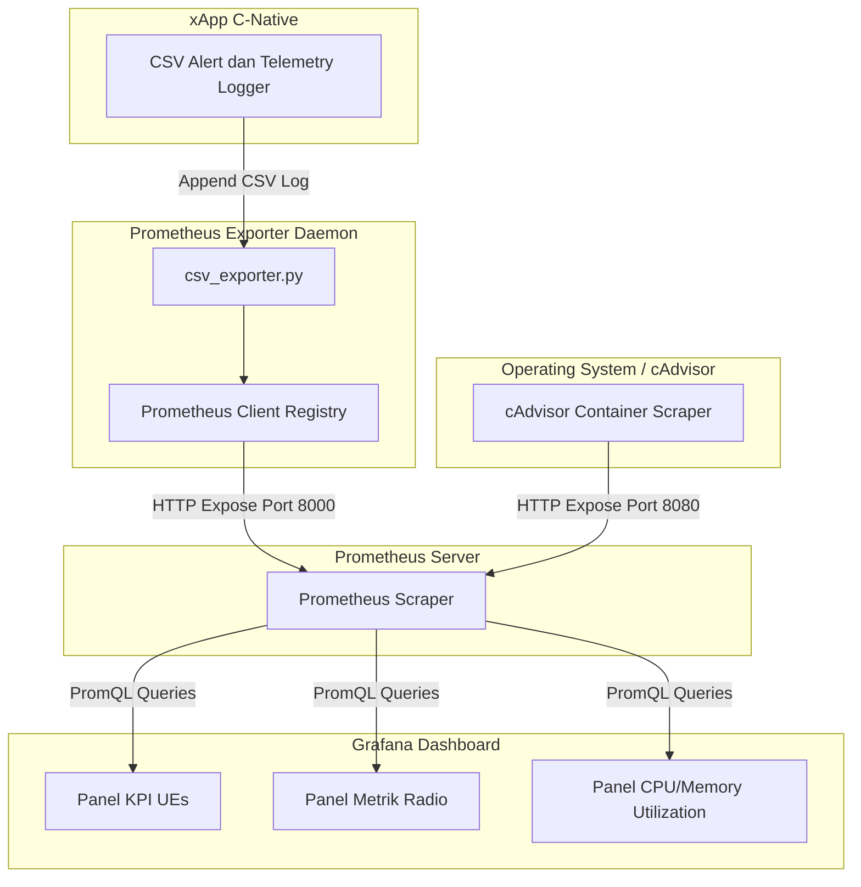
<p align="center">Gambar 3.10 Blok Diagram Pemodelan Fungsional Subsistem Dashboard Visualisasi dan Monitoring</p>

Fungsi logging di dalam xApp C menulis baris entri baru secara asinkron ke dalam berkas CSV. Modul eksportir berbasis Python mendeteksi baris baru tersebut, memperbarui registri Prometheus internal, dan mengeksposnya pada port HTTP 8000. Prometheus Server bertindak sebagai pengumpul (*scraper*) aktif yang menarik metrik dari eksportir dan data pemakaian kontainer dari cAdvisor (port 8080). Grafana kemudian mengirimkan kueri PromQL secara periodik untuk memperbarui panel visualisasi. Blok diagram fungsional subsistem monitoring ini menggambarkan aliran data log dari xApp hingga ke dashboard visualisasi. Proses ini memisahkan secara tegas tugas perekaman log asinkron pada xApp C dengan tugas pemaparan metrik oleh eksportir Python (`csv_exporter.py`) yang berjalan sebagai daemon port 8000. Prometheus Server bertindak sebagai scraper aktif yang menarik metrik dari eksportir dan data utilisasi container dari cAdvisor (port 8080). Grafana kemudian mengirimkan kueri PromQL secara periodik untuk memperbarui panel visualisasi pada dashboard evaluasi dan pemantauan langsung secara real-time.

Tingkah laku dinamis dari subsistem monitoring dalam melakukan polling berkas log secara berkala, mengekspos data metrik ke server, dan memperbarui grafik visualisasi dimodelkan pada Gambar 3.11.

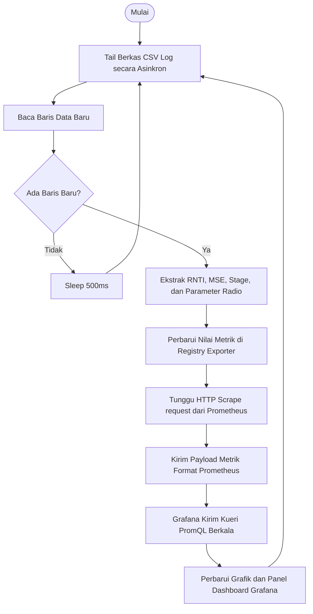
<p align="center">Gambar 3.11 Flowchart Pemodelan Tingkah Laku Subsistem Dashboard Visualisasi dan Monitoring</p>

Tingkah laku subsistem ini berputar pada loop pencatatan log asinkron. Eksportir Python melakukan polling file log CSV setiap 500 ms. Ketika terdeteksi adanya entri log baru, data diekstrak dan didaftarkan ke registri Prometheus. Proses ini berlanjut secara kontinu sehingga kueri visualisasi Grafana selalu menerima data metrik terbaru dengan latensi minimal. Tingkah laku dinamis dari subsistem visualisasi berjalan sebagai loop tailing log tak berujung (*infinite loop*). Eksportir Python secara asinkron melakukan pemantauan berkas log CSV. Jika tidak ada baris data baru, eksportir memasuki mode tidur (sleep 500 ms) untuk menghemat I/O disk dan utilisasi CPU server. Ketika entri baru terdeteksi, data RNTI, Reconstruction Error, alert type, dan metrik radio diekstrak untuk memperbarui registri Prometheus internal, menunggu scrape request HTTP dari Prometheus Server untuk mengirimkan metrik terformat, yang kemudian ditarik secara periodik oleh kueri PromQL Grafana untuk memperbarui render grafik visualisasi.

---

## 3.2 Implementasi

Realisasi rancangan sistem diwujudkan ke dalam bentuk konfigurasi fisik perangkat keras, pembuatan model pembelajaran mendalam, serta pengkodean program xApp dalam lingkungan testbed.

### 3.2.1 Subsistem Integrasi dan Komunikasi E2

Realisasi subsistem ini mencakup konfigurasi lingkungan testbed fisik multi-node, integrasi perutean data pada 5G Core, registrasi kartu SIM pelanggan, serta implementasi aksi kontrol mitigasi E2SM-RC pada sisi Near-RT RIC.

#### 1. Realisasi Lingkungan Testbed (srsRAN & Open5GS)
Testbed fisik dikonfigurasi pada tiga unit PC server bare metal yang seluruhnya menjalankan OS **Ubuntu 24.04.4 LTS** dan saling terhubung menggunakan kabel Gigabit Ethernet. Spesifikasi perangkat keras tiap node dirinci pada Tabel 3.4.

**Tabel 3.4 Spesifikasi Perangkat Keras Tiap Node Testbed**

| Node | IP | CPU | Jumlah Core | RAM |
|---|---|---|---|---|
| RAN (gNodeB) | `10.91.2.1` | Intel Core i5-6500 @3.20GHz | 4 | 32 GB |
| Near-RT RIC | `10.91.2.2` | Intel Core i5-7500 @3.40GHz | 4 | 32 GB |
| 5G Core | `10.91.2.4` | Intel Core i5-8500T @2.10GHz | 6 | 32 GB |

##### A. Konfigurasi gNodeB (srsRAN Project)
Konfigurasi gNodeB didefinisikan menggunakan format YAML pada berkas `cots_n78_copied.yml` seperti diperlihatkan pada Gambar 3.12. Konfigurasi agen E2 internal diaktifkan agar gNodeB dapat melakukan inisialisasi koneksi E2AP SCTP ke RIC Node (IP `10.91.2.2`).

```yaml
# cots_n78_copied.yml - Konfigurasi gNodeB & E2 Agent srsRAN
amf:
  addr: 10.91.2.4          # AMF (Core Node)
  port: 38412              # N2 (NGAP/SCTP)
  bind_addr: 10.91.2.1

ru_sdr:
  device_driver: uhd
  device_args: type=b200   # Ettus USRP B210
  srate: 46.08
  tx_gain: 80
  rx_gain: 40

cell_cfg:
  dl_arfcn: 627340         # Pita n78
  band: 78
  channel_bandwidth_MHz: 40
  common_scs: 30           # Subcarrier spacing 30 kHz
  plmn: '00101'            # MCC 001 / MNC 01
  tac: 7
  pci: 1

e2:
  enable_du_e2: true
  e2sm_kpm_enabled: true
  e2sm_rc_enabled: true    # wajib aktif untuk mitigasi E2SM-RC
  addr: 10.91.2.2          # Near-RT RIC
  port: 36421              # E2AP (SCTP)
  bind_addr: 10.91.2.1
```
<p align="center">Gambar 3.12 Cuplikan Kode Konfigurasi gNodeB <code>cots_n78_copied.yml</code> pada srsRAN Project</p>

##### B. Konfigurasi 5G Core (Open5GS)
Pengaturan alokasi IP pool UE dan DNN dikonfigurasi pada berkas SMF (`smf.yaml`) di Core Node seperti diperlihatkan pada Gambar 3.13, sedangkan irisan jaringan (*S-NSSAI*, SST=1 eMBB) didefinisikan pada tingkat PLMN (`00101`). Antarmuka layanan internal Open5GS (SBI/PFCP/GTP-U) menggunakan alamat loopback.

```yaml
# smf.yaml - Konfigurasi SMF Open5GS (Core Node)
smf:
  sbi:
    - address: 127.0.0.4   # SBI internal Open5GS (loopback)
      port: 7777
  pfcp:
    - address: 127.0.0.4
  gtpu:
    - address: 127.0.0.4
  session:
    - subnet: 10.45.0.0/16     # Alokasi IP Pool untuk UE (DNN: internet)
    - subnet: 2001:db8:cafe::/48
```
<p align="center">Gambar 3.13 Cuplikan Kode Konfigurasi SMF <code>smf.yaml</code> pada Open5GS</p>

##### C. Registrasi Subscriber User Equipment (UE) pada Open5GS
Agar perangkat Oppo Reno 8 5G dan Motorola G35 5G dapat melakukan registrasi ke 5G Core Network secara aman, data kartu SIM (USIM) diprogram menggunakan kunci keamanan yang terdaftar pada database MongoDB Open5GS. Pengikatan data USIM (IMSI, *Key* $K$, dan *OPc*) diatur melalui antarmuka WebUI Open5GS. Konfigurasi profil subscriber masing-masing perangkat ditunjukkan pada Gambar 3.14 dan Gambar 3.15.


<p align="center">Gambar 3.14 Tampilan Konfigurasi Profil Subscriber UE Motorola G35 5G pada WebUI Open5GS</p>


<p align="center">Gambar 3.15 Tampilan Konfigurasi Profil Subscriber UE Oppo Reno 8 5G pada WebUI Open5GS</p>

#### 2. Realisasi Subsistem Mitigasi E2SM-RC
Aksi kontrol mitigasi ditangani oleh modul E2SM-RC yang menyusun kode ASN.1 pesan persinyalan E2SM-RC Control Request untuk membatasi alokasi Physical Resource Block (PRB) pada sisi gNodeB seperti diperlihatkan pada Gambar 3.16.

```c
// xapp_sec_mitigate.c - E2SM-RC Control Trigger (Style 2 / Action 6)
// Membatasi alokasi PRB (RRM Policy Ratio) untuk UE target.

// Control Header (Format 1): Style 2, Action 6, UE ID = gNB-DU F1AP
static e2sm_rc_ctrl_hdr_frmt_1_t build_ctrl_hdr(void) {
    e2sm_rc_ctrl_hdr_frmt_1_t hdr = {0};
    hdr.ric_style_type = 2;   // Style 2: Radio Resource Allocation Control
    hdr.ctrl_act_id    = 6;   // Action 6: PRB Quota / RRM Policy
    hdr.ue_id.type     = GNB_DU_UE_ID_E2SM;
    hdr.ue_id.gnb_du.gnb_cu_ue_f1ap = g_ue_f1ap;
    return hdr;
}

// Eksekusi: kirim Control Request berisi RRM Policy Ratio (max PRB = max_prb%)
static int execute_rc_control(int max_prb) {
    rc_ctrl_req_data_t rc_ctrl = {0};
    rc_ctrl.hdr.format = FORMAT_1_E2SM_RC_CTRL_HDR;
    rc_ctrl.hdr.frmt_1 = build_ctrl_hdr();
    rc_ctrl.msg.format = FORMAT_1_E2SM_RC_CTRL_MSG;
    rc_ctrl.msg.frmt_1 = build_ctrl_msg(max_prb);  // RRM Policy: min=0, max=ded=max_prb

    control_sm_xapp_api(&g_du_node_id, g_rc_rf_id, &rc_ctrl);
    free_rc_ctrl_req_data(&rc_ctrl);
    printf("[MITIGATE] E2SM-RC sent: max_prb=%d%%\n", max_prb);  // throttle=5, restore=100
    return 1;
}
```
<p align="center">Gambar 3.16 Cuplikan Kode Realisasi Subsistem Mitigasi E2SM-RC <code>xapp_sec_mitigate.c</code> pada xApp</p>


### 3.2.2 Subsistem Deteksi Anomali Hibrida

Realisasi deteksi anomali diwujudkan melalui pemrograman model pembelajaran mendalam berbasis PyTorch, ekspor model ke format ONNX, serta pengintegrasian engine ONNX Runtime C API pada unit xApp FlexRIC.

#### 1. Pelatihan Model LSTM-Autoencoder & Ekspor ONNX
Pembuatan arsitektur model LSTM-Autoencoder ditulis menggunakan bahasa pemrograman Python 3.10 dengan pustaka PyTorch 2.1. Model didefinisikan secara simetris sesuai rancangan pemodelan fungsional.

```python
# lstm_autoencoder.py - PyTorch Model Definition
import torch
import torch.nn as nn

class TemporalAttention(nn.Module):
    """Self-attention antar-timestep: memberi bobot lebih pada timestep anomalous."""
    def __init__(self, hidden_dim):
        super().__init__()
        self.attn = nn.Linear(hidden_dim, 1)
    def forward(self, out):                                   # (B, T, H)
        w = torch.softmax(self.attn(out).squeeze(-1), dim=1).unsqueeze(-1)
        return (out * w).sum(dim=1)                           # (B, H)

class LSTMEncoder(nn.Module):
    def __init__(self, no_features, hidden=[64, 32], latent_dim=32):
        super().__init__()
        # LSTM unidirectional (bidirectional=False untuk model LSTM-AE)
        self.lstm1 = nn.LSTM(no_features, hidden[0], batch_first=True)
        self.lstm2 = nn.LSTM(hidden[0],   hidden[1], batch_first=True)
        self.attention = TemporalAttention(hidden[1])
        self.fc = nn.Linear(hidden[1], latent_dim)
    def forward(self, x):
        out, _ = self.lstm1(x)
        out, _ = self.lstm2(out)
        return self.fc(self.attention(out))                  # (B, latent_dim)

class LSTMDecoder(nn.Module):
    def __init__(self, latent_dim=32, hidden=[32, 64], no_features=19, seq_len=30):
        super().__init__()
        self.seq_len = seq_len
        self.fc = nn.Linear(latent_dim, hidden[0])
        self.lstm1 = nn.LSTM(hidden[0], hidden[1],   batch_first=True)
        self.lstm2 = nn.LSTM(hidden[1], no_features, batch_first=True)
    def forward(self, z):
        h = self.fc(z).unsqueeze(1).repeat(1, self.seq_len, 1)  # proyeksi + repeat x30
        out, _ = self.lstm1(h)
        out, _ = self.lstm2(out)
        return out                                           # (B, seq_len, no_features)

class LSTMAutoencoder(nn.Module):
    def __init__(self, seq_len=30, no_features=19, latent_dim=32):
        super().__init__()
        self.encoder = LSTMEncoder(no_features, [64, 32], latent_dim)
        self.decoder = LSTMDecoder(latent_dim, [32, 64], no_features, seq_len)
    def forward(self, x):
        return self.decoder(self.encoder(x))
```
<p align="center">Gambar 3.17 Cuplikan Kode Definisi Model LSTM-Autoencoder <code>lstm_autoencoder.py</code></p>

Setelah proses pelatihan menggunakan data normal selesai, model dikonversi menjadi berkas portabel ONNX agar dapat dimuat dan dijalankan secara native oleh xApp C menggunakan engine ONNX Runtime C API.

```python
# export_onnx_ue.py - Bake MinMaxScaler + Weighted MSE (Scheme A) ke dalam ONNX
import torch, pickle
import torch.nn as nn
from src.detection.lstm_autoencoder import LSTMAutoencoder
from src.detection.feature_schema_ue import FEATURE_WEIGHTS, FEATURE_NAMES

class ONNXPerUEWrapper(nn.Module):
    """Input: fitur mentah [B,30,19] → Output: skalar Weighted MSE (node 'mse')."""
    def __init__(self, model, scaler, weights):
        super().__init__()
        self.model = model
        self.a = nn.Parameter(torch.tensor(scaler.scale_, dtype=torch.float32), requires_grad=False)
        self.b = nn.Parameter(torch.tensor(scaler.min_,   dtype=torch.float32), requires_grad=False)
        self.w = nn.Parameter(weights / weights.sum(), requires_grad=False)  # Scheme A ternormalisasi

    def forward(self, x):
        x = x * self.a + self.b                 # MinMaxScaler
        recon = self.model(x)
        fe = ((x - recon) ** 2).mean(dim=1)     # rata-rata 30 timestep -> [B, 19]
        return (fe * self.w).sum(dim=-1)        # Weighted MSE skalar -> [B]

model = LSTMAutoencoder(seq_len=30, no_features=19, latent_dim=32)
model.load_state_dict(torch.load("models/lstm_ue_v4.pt", map_location="cpu")["model_state_dict"])
scaler  = pickle.load(open("models/lstm_ue_v4_scaler.pkl", "rb"))
weights = torch.tensor([FEATURE_WEIGHTS[n] for n in FEATURE_NAMES])
wrapped = ONNXPerUEWrapper(model.eval(), scaler, weights).eval()

torch.onnx.export(
    wrapped, torch.zeros(1, 30, 19), "models/lstm_ue_v4.onnx",
    opset_version=14, do_constant_folding=True,
    input_names=["input"], output_names=["mse"],
    dynamic_axes={"input": {0: "batch"}, "mse": {0: "batch"}},
)
print("Model LSTM-AE (scaler + weighted MSE) berhasil diekspor ke ONNX.")
```
<p align="center">Gambar 3.18 Cuplikan Kode Ekspor Wrapper LSTM-Autoencoder ke ONNX <code>export_onnx_ue.py</code></p>

Prosedur perhitungan matematis diwujudkan secara terprogram di dalam grafik komputasi ONNX melalui rumus-rumus berikut:
1.  **Normalisasi MinMaxScaler**:
    Masing-masing fitur masukan mentah $x_{t,i}$ ($i=1,\dots,19$) diskalakan ke rentang $[0, 1]$ menggunakan:
    $$x'_{t,i} = x_{t,i} \cdot a_i + b_i$$
    di mana $a_i = \text{scaler.scale\_}[i]$ dan $b_i = \text{scaler.min\_}[i]$, yang dimodelkan sebagai parameter terdaftar `self.a` dan `self.b` (Gambar 3.18).
2.  **Mean Squared Error (MSE) per-Fitur**:
    Kesalahan kuadrat rata-rata per-fitur sepanjang urutan waktu ($T=30$) dihitung sebagai:
    $$FE_i = \frac{1}{T}\sum_{t=1}^{T} (x'_{t,i} - \hat{x}_{t,i})^2$$
    di mana $\hat{x}_{t,i}$ adalah nilai hasil rekonstruksi model. Pada PyTorch, hal ini dihitung secara batch menggunakan operasi rata-rata dimensi temporal `fe = ((x - recon) ** 2).mean(dim=1)` (Gambar 3.18).
3.  **Weighted Mean Squared Error (Weighted MSE)**:
    Hasil kesalahan rekonstruksi akhir ($RE$) UE diperoleh dengan menjumlahkan secara berbobot hasil MSE fitur menggunakan bobot kontribusi *Scheme A* yang dinormalisasi ($\bar{w}$):
    $$RE = \sum_{i=1}^{d} \bar{w}_i \cdot FE_i$$
    di mana $d=19$ dan $\sum \bar{w}_i = 1$. Pada PyTorch, nilai skalar $RE$ diperoleh menggunakan perkalian titik `(fe * self.w).sum(dim=-1)` (Gambar 3.18) yang dikeluarkan sebagai output `mse` ONNX.

#### 2. Integrasi ONNX Runtime C API pada xApp
xApp keamanan dibangun menggunakan bahasa pemrograman C Native dengan memanfaatkan SDK FlexRIC. xApp ini memuat model ONNX secara real-time pada saat inisialisasi awal.

```c
// sec_ids_ue.c - ONNX Runtime C API Initialization
#include <onnxruntime_c_api.h>
#include "sec_ids_ue.h"

OrtEnv* g_ort_env = NULL;
OrtSession* g_ort_session = NULL;
OrtSessionOptions* g_session_options = NULL;
OrtMemoryInfo* g_memory_info = NULL;

int init_onnx_runtime(const char* model_path) {
    const OrtApi* g_ort = OrtGetApiBase()->GetApi(ORT_API_VERSION);
    if (!g_ort) return -1;

    // Inisialisasi Environment ONNX
    g_ort->CreateEnv(ORT_LOGGING_LEVEL_WARNING, "SecurityxAppEnv", &g_ort_env);
    g_ort->CreateSessionOptions(&g_session_options);
    g_ort->SetSessionOptionsCpuMemArenaState(g_session_options, 1);

    // Buat Session Baru
    OrtStatus* status = g_ort->CreateSession(g_ort_env, model_path, g_session_options, &g_ort_session);
    if (status != NULL) {
        g_ort->ReleaseStatus(status);
        return -1;
    }

    g_ort->CreateCpuMemoryInfo(OrtArenaAllocator, OrtMemTypeDefault, &g_memory_info);
    return 0; // Inisialisasi Sukses
}
```
<p align="center">Gambar 3.19 Cuplikan Kode Inisialisasi ONNX Runtime C API <code>sec_ids_ue.c</code></p>

Setiap kali laporan metrik E2SM-KPM dari UE tertentu diterima, xApp menghitung 19 fitur masukan temporal lalu menjalankan inferensi ONNX. Karena normalisasi MinMaxScaler dan perhitungan Weighted MSE telah dibakukan ke dalam berkas ONNX, masukan model berupa **fitur mentah** `[1, 30, 19]` dan keluarannya berupa **skalar Reconstruction Error** (node `mse`).

```c
// sec_ids_ue.c - ONNX Inference Loop (keluaran skalar "mse")
// MinMaxScaler + Weighted MSE (Scheme A) sudah dibakukan di dalam ONNX,
// sehingga keluaran model langsung berupa skalar Reconstruction Error.

float run_inference_ue(const float* input_30x19) {
    const OrtApi* g_ort = OrtGetApiBase()->GetApi(ORT_API_VERSION);

    // Tensor masukan fitur mentah [1, 30, 19]
    int64_t input_shape[3] = {1, 30, 19};
    size_t input_size = 1 * 30 * 19 * sizeof(float);

    OrtValue* input_tensor = NULL;
    g_ort->CreateTensorWithDataAsOrtValue(
        g_memory_info, (void*)input_30x19, input_size,
        input_shape, 3, ONNX_TENSOR_ELEMENT_DATA_TYPE_FLOAT, &input_tensor);

    const char* input_names[]  = {"input"};
    const char* output_names[] = {"mse"};   // node keluaran skalar
    OrtValue* output_tensor = NULL;

    // Jalankan inferensi (LSTM-AE)
    g_ort->Run(g_ort_session, NULL, input_names,
               (const OrtValue**)&input_tensor, 1,
               output_names, 1, &output_tensor);

    // Baca skalar Reconstruction Error langsung dari keluaran ONNX
    float* output_data = NULL;
    g_ort->GetTensorMutableData(output_tensor, (void**)&output_data);
    float re = output_data[0];   // Weighted MSE rata-rata 30 timestep

    g_ort->ReleaseValue(input_tensor);
    g_ort->ReleaseValue(output_tensor);
    return re;                    // dibandingkan dengan threshold di decision_engine_ue()
}
```
<p align="center">Gambar 3.20 Cuplikan Kode Loop Inferensi ONNX Runtime C API <code>run_inference_ue</code> pada xApp</p>

Pengambilan keputusan status anomali akhir diintegrasikan dalam unit mesin keputusan (`decision_engine_ue`) yang memuat batas ambang batas keputusan (*decision threshold*) optimal ($Th = 0,025266$) untuk model `lstm-hybrid`.

```c
// sec_ids_ue.c - Decision Engine Implementation
#include <string.h>
#include "sec_ids_ue.h"

int decision_engine_ue(const char* ids_mode, float re_score, int rule_triggered) {
    float threshold = 0.025266; // Batas Ambang Keputusan untuk LSTM-AE
    int ml_triggered = (re_score > threshold) ? 1 : 0;

    if (strcmp(ids_mode, "rule-only") == 0) {
        return rule_triggered;
    } else if (strcmp(ids_mode, "lstm-only") == 0) {
        return ml_triggered;
    } else if (strcmp(ids_mode, "lstm-hybrid") == 0) {
        // Logika Penggabungan Hibrida Paralel: Rule OR ML (Rule ∪ ML)
        return (rule_triggered || ml_triggered) ? 1 : 0;
    }

    return 0; // Normal
}
```
<p align="center">Gambar 3.21 Cuplikan Kode Implementasi Mesin Keputusan Hibrida <code>decision_engine_ue</code> pada xApp</p>

### 3.2.3 Subsistem Dashboard Visualisasi dan Monitoring

Realisasi pencatatan log pada xApp C dan eksposur metrik visual pada Near-RT RIC diwujudkan melalui server **Prometheus Exporter berbasis Python** (`csv_exporter.py`) serta integrasi data cAdvisor untuk memantau performa kontainer pada dashboard Grafana.

#### 1. Implementasi CSV Logger
Penyimpanan log real-time ke dalam berkas CSV diimplementasikan secara native di dalam xApp C. Setiap peristiwa deteksi per-UE ditulis dalam mode *append* dan langsung di-`fflush` agar tersimpan, dengan mekanisme *debounce* untuk mencegah baris duplikat.

```c
// xapp_sec_moni.c - Per-UE Alert CSV Logger
// Header: timestamp_ms,rnti,rule_mask,rule_stage,mse,threshold,alert_type
#include <stdio.h>

void csv_alert_write(FILE* fp, long long ts_ms, uint16_t rnti,
                     uint32_t rule_mask, int rule_stage,
                     float mse, float threshold, const char* alert_type) {
    if (!fp) return;
    fprintf(fp, "%lld,%u,%u,%d,%.6f,%.6f,%s\n",
            ts_ms, rnti, rule_mask, rule_stage, mse, threshold, alert_type);
    fflush(fp);   // tulis langsung (append) ke berkas
}
```
<p align="center">Gambar 3.22 Cuplikan Kode Per-UE Alert CSV Logger <code>xapp_sec_moni.c</code> pada xApp</p>

#### 2. Eksposur Metrik Prometheus dan Integrasi Grafana
Visualisasi real-time diekspos ke Prometheus menggunakan format metrik berikut (berlabel `rnti` untuk metrik spesifik UE) yang dideklarasikan oleh Prometheus Exporter (`csv_exporter.py`):
*   `xapp_ue_mse`: Nilai *Reconstruction Error* (Weighted MSE) per-UE.
*   `xapp_ue_alert_type`: Jenis alert per-UE (0=none, 1=ul_flood, 2=dl_flood, 3=burst, 4=roq).
*   `xapp_ue_stage`: Tahap deteksi IDS per-UE (0=Normal, 1=Stage 1, 2=Stage 2 / kritis).
*   `xapp_ue_prb_ul`, `xapp_ue_prb_dl`, `xapp_ue_prb_direction`, `xapp_ue_ul_efficiency`: Parameter radio per-UE.
*   `xapp_total_blocked_attacks`: Metrik akumulatif (*counter*) global yang merekam jumlah total serangan yang berhasil ditangani sejak awal berjalan.

Selain metrik spesifik xApp di atas, dilakukan pengumpulan metrik kinerja sistem dari kontainer xApp via **cAdvisor** yang diintegrasikan ke dalam konfigurasi `docker-compose` testbed. Metrik kontainer yang di-scrape oleh Prometheus meliputi:
*   `container_cpu_usage_seconds_total`: Akumulasi waktu CPU yang digunakan oleh kontainer xApp, dikonversi menjadi persentase utilisasi CPU (%) secara berkala.
*   `container_memory_usage_bytes`: Volume memori RAM aktual yang dikonsumsi oleh kontainer xApp (MB).

Pengikatan (*wiring*) metrik ini divisualisasikan menggunakan Grafana dashboard melalui kueri database Prometheus (PromQL) untuk memantau stabilitas sistem serta membuktikan secara empiris bahwa xApp deteksi hibrida memiliki konsumsi daya komputasi yang sangat rendah di RIC Node. Konfigurasi interkoneksi metrik diwujudkan dalam dua visualisasi dashboard utama pada Grafana:
1.  **Dashboard Evaluasi Deteksi Serangan**: Menyajikan hasil analisis performa deteksi luring, termasuk grafik perbandingan Reconstruction Error model LSTM-AE terhadap ambang batas, laju True Positive (Recall), False Positive Rate, serta matriks konfusi deteksi hibrida paralel. Tampilan dashboard evaluasi ini ditunjukkan pada Gambar 3.23.


<p align="center">Gambar 3.23 Tampilan Dashboard Evaluasi Deteksi Serangan pada Grafana</p>

2.  **Dashboard Pemantauan Langsung (Per-UE Live Monitor)**: Menyajikan grafik pemantauan waktu nyata untuk metrik fisik radio (throughput, PRB allocation, uplink efficiency) per target UE (RNTI), status stage deteksi keamanan (Normal, Stage 1, Stage 2), jenis serangan terdeteksi, total serangan yang diblokir, serta persentase beban utilisasi CPU dan RAM kontainer xApp. Tampilan dashboard live ini ditunjukkan pada Gambar 3.24.


<p align="center">Gambar 3.24 Tampilan Dashboard Pemantauan Langsung (Per-UE Live Monitor) pada Grafana</p>