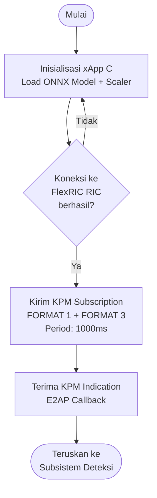

```mermaid
flowchart TD
    START([Mulai])
    INIT["Inisialisasi xApp C\nLoad ONNX Model + Scaler"]
    CONN{"Koneksi ke\nFlexRIC RIC\nberhasil?"}
    SUB["Kirim KPM Subscription\nFORMAT 1 + FORMAT 3\nPeriod: 1000ms"]
    IND["Terima KPM Indication\nE2AP Callback"]
    END([Teruskan ke\nSubsistem Deteksi])

    START --> INIT
    INIT --> CONN
    CONN -- Tidak --> INIT
    CONN -- Ya --> SUB
    SUB --> IND
    IND --> END
```
