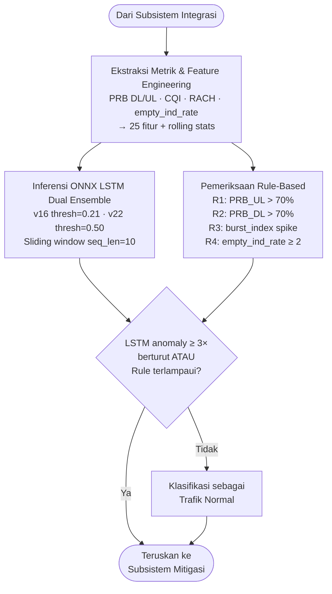

```mermaid
flowchart TD
    START([Dari Subsistem Integrasi])
    FEAT["Ekstraksi Metrik & Feature Engineering\nPRB DL/UL · CQI · RACH · empty_ind_rate\n→ 25 fitur + rolling stats"]
    LSTM["Inferensi ONNX LSTM Dual Ensemble\nv16 thresh=0.21 · v22 thresh=0.50\nSliding window seq_len=10"]
    RULE["Pemeriksaan Rule-Based\nR1: PRB_UL > 70%\nR2: PRB_DL > 70%\nR3: burst_index spike\nR4: empty_ind_rate ≥ 2"]
    S1{"LSTM anomaly ≥ 3×\nberturut ATAU\nRule terlampaui?"}
    NORMAL["Klasifikasi sebagai\nTrafik Normal"]
    END([Teruskan ke\nSubsistem Mitigasi])

    START --> FEAT
    FEAT --> LSTM
    FEAT --> RULE
    LSTM --> S1
    RULE --> S1
    S1 -- Tidak --> NORMAL
    S1 -- Ya --> END
    NORMAL --> END
```
