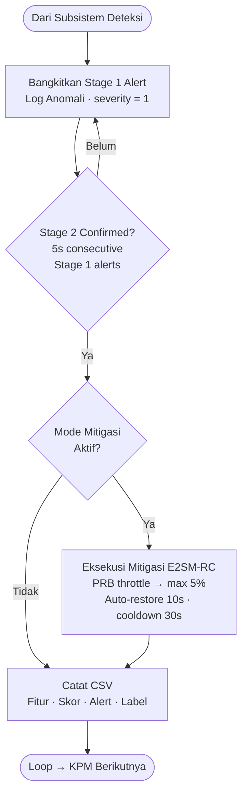

```mermaid
flowchart TD
    START([Dari Subsistem Deteksi])
    LOG1["Bangkitkan Stage 1 Alert\nLog Anomali · severity = 1"]
    S2{"Stage 2 Confirmed?\n5s consecutive\nStage 1 alerts"}
    MFLAG{"Mode Mitigasi\nAktif?"}
    MITIGATE["Eksekusi Mitigasi E2SM-RC\nPRB throttle → max 5%\nAuto-restore 10s · cooldown 30s"]
    CSV["Catat CSV\nFitur · Skor · Alert · Label"]
    LOOP([Loop → KPM Berikutnya])

    START --> LOG1
    LOG1 --> S2
    S2 -- Belum --> LOG1
    S2 -- Ya --> MFLAG
    MFLAG -- Ya --> MITIGATE
    MFLAG -- Tidak --> CSV
    MITIGATE --> CSV
    CSV --> LOOP
```
