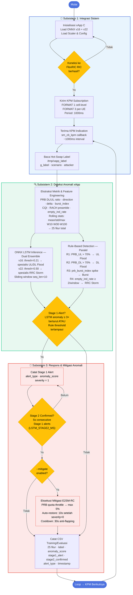

```mermaid
flowchart TD
    START([Mulai]) --> INIT

    subgraph SYS ["🔗 Subsistem 1: Integrasi Sistem"]
        INIT["Inisialisasi xApp C\nLoad ONNX v16 + v22\nLoad Scaler & Config"]
        CONN{"Koneksi ke\nFlexRIC RIC\nberhasil?"}
        SUB["Kirim KPM Subscription\nFORMAT 1 cell-level\nFORMAT 3 per-UE\nPeriod: 1000ms"]
        IND["Terima KPM Indication\nsm_cb_kpm callback\n~1000ms interval"]
        LABEL["Baca Hot-Swap Label\n/tmp/xapp_label\ng_label · scenario · attacker"]

        INIT --> CONN
        CONN -- Tidak --> INIT
        CONN -- Ya --> SUB
        SUB --> IND
        IND --> LABEL
    end

    subgraph DET ["🔍 Subsistem 2: Deteksi Anomali xApp"]
        FEAT["Ekstraksi Metrik & Feature Engineering\nPRB DL/UL ratio · direction · delta · burst_index\nCQI · RACH preamble · empty_ind_rate\nRolling stats: mean/std/max W10·W30·W100\n→ 25 fitur total"]

        LSTM["ONNX LSTM Inference — Dual Ensemble\nv16: thresh=0.21 → spesialis UL/DL Flood\nv22: thresh=0.50 → spesialis RRC Storm\nSliding window seq_len=10"]

        RULE["Rule-Based Detection — Paralel\nR1: PRB_UL > 70%  →  UL Flood\nR2: PRB_DL > 70%  →  DL Flood\nR3: prb_burst_index spike  →  Burst\nR4: empty_ind_rate ≥ 2/window  →  RRC Storm"]

        S1{"Stage 1 Alert?\nLSTM anomaly ≥ 3×\nberturut ATAU\nRule threshold\nterlampaui"}

        FEAT --> LSTM
        FEAT --> RULE
        LSTM --> S1
        RULE --> S1
    end

    subgraph MIT ["🚨 Subsistem 3: Respons & Mitigasi Anomali"]
        LOG1["Catat Stage 1 Alert\nalert_type · anomaly_score\nseverity = 1"]

        S2{"Stage 2 Confirmed?\n5s consecutive\nStage 1 alerts\n(LSTM_STAGE2_MS)"}

        MFLAG{"--mitigate\nenabled?"}

        MITIGATE["Eksekusi Mitigasi E2SM-RC\nPRB quota throttle → max 5%\nAuto-restore: 10s setelah severity=0\nCooldown: 30s anti-flapping"]

        CSV["Catat CSV Training/Evaluasi\n25 fitur · label · anomaly_score\nstage1_alert · stage2_confirmed\nalert_type · timestamp"]

        LOG1 --> S2
        S2 -- Belum --> LOG1
        S2 -- Ya --> MFLAG
        MFLAG -- Ya --> MITIGATE
        MFLAG -- Tidak --> CSV
        MITIGATE --> CSV
    end

    LOOP([Loop → KPM Berikutnya])

    LABEL --> FEAT
    S1 -- Tidak --> CSV
    S1 -- Ya --> LOG1
    CSV --> LOOP
    LOOP --> IND

    style SYS fill:#e8f4fd,stroke:#4e73df,stroke-width:2px,color:#000
    style DET fill:#e8f8f0,stroke:#1cc88a,stroke-width:2px,color:#000
    style MIT fill:#fde8e8,stroke:#e74a3b,stroke-width:2px,color:#000
    style START fill:#4e73df,color:#fff,stroke:#2e59d9
    style LOOP fill:#4e73df,color:#fff,stroke:#2e59d9
    style CONN fill:#ffc107,stroke:#e0a800,color:#000
    style S1 fill:#ffc107,stroke:#e0a800,color:#000
    style S2 fill:#ffc107,stroke:#e0a800,color:#000
    style MFLAG fill:#ffc107,stroke:#e0a800,color:#000
    style MITIGATE fill:#fde8e8,stroke:#e74a3b,color:#000
    style LOG1 fill:#fde8e8,stroke:#e74a3b,color:#000
```
