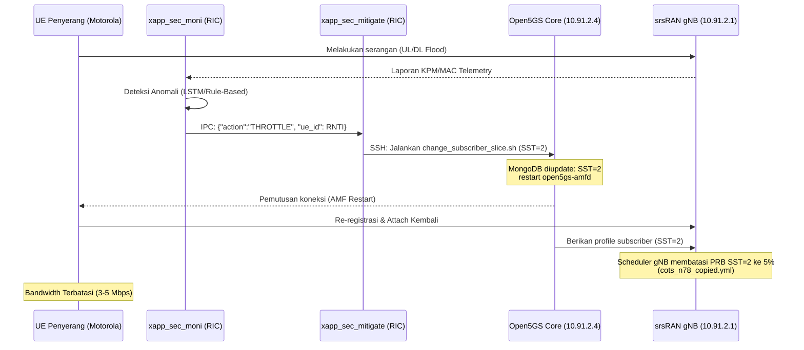

# Walkthrough: Dynamic Slice Mitigation Deployment (Solusi A)

Panduan ini menjelaskan langkah-langkah untuk menerapkan dan memvalidasi **Solusi A: Dynamic Multi-Slicing** guna mengkarantina UE penyerang (IMSI: `001013310000103`) secara dinamis tanpa mempengaruhi UE normal lainnya.

---

## Arsitektur Alur Mitigasi



---

## Langkah 1: Sinkronisasi Konfigurasi gNB

```bash
bash sync_gnb_config.sh
```

> [!NOTE]
> Script di atas akan menyalin berkas ke path `/home/telmat/TA-Rizqi-Nabiel/O-RAN-Testbed-Automation/Next_Generation_Node_B/configs/cots_n78_copied.yml` pada mesin gNB menggunakan `scp`.

---

## Langkah 1b: Patch & Recompile gNB (Mencegah Segfault srsRAN)

srsRAN gNB memiliki bug bawaan (*out-of-bounds memory access*) pada modul pelaporan telemetry per-UE KPM Style 4. Ketika UE berpindah slice secara dinamis, gNB mencoba mengakses metrik UE yang belum sepenuhnya terinisialisasi pada slice baru, menyebabkan crash **Segmentation fault**.

Kami telah menyediakan script patch otomatis untuk memperbaiki bug bounds-checking ini dan mengompilasi ulang gNB di mesin remote (`10.91.2.1`):

```bash
bash patch_and_rebuild_gnb.sh
```

> [!IMPORTANT]
> Jalankan perintah di atas sekali sebelum memulai pengujian agar gNB tidak mengalami crash saat UE penyerang diisolasi ke slice `SST=2`.

---

## Langkah 2: Re-kompilasi xApp Mitigasi

Kompilasi ulang xApp mitigasi dengan logika baru untuk menjalankan script perpindahan slice Core Network:

```bash
bash rebuild_xapp.sh
```

---

## Langkah 3: Verifikasi Konfigurasi Slice di Open5GS Core (10.91.2.4)

Sebelum menjalankan sistem, pastikan Open5GS Core mendukung `sst: 2` secara administratif. Masuk ke mesin Core Network (`10.91.2.4`) dan verifikasi berkas berikut:

### 1. `/etc/open5gs/amf.yaml`
Pastikan `sst: 2` terdaftar pada list PLMN support:
```yaml
amf:
    plmn_support:
      - plmn_id:
          mcc: 001
          mnc: 01
        s_nssai:
          - sst: 1
          - sst: 2
```

### 2. `/etc/open5gs/upf.yaml`
> [!NOTE]
> Karena berkas `upf.yaml` Anda tidak mendefinisikan field `s_nssai` secara eksplisit, UPF Open5GS bertindak sebagai **wildcard** secara default. Ini berarti UPF secara otomatis mendukung dan melayani trafik dari slice manapun (baik `SST=1` maupun `SST=2`) yang diinisiasi oleh SMF. Oleh karena itu, **tidak perlu ada perubahan pada `upf.yaml`**.

> [!IMPORTANT]
> Jika ada perubahan pada konfigurasi AMF (`amf.yaml`) di atas, restart service AMF di mesin `10.91.2.4`:
> ```bash
> sudo systemctl restart open5gs-amfd
> ```

---

## Langkah 4: Menjalankan Sistem Mitigasi

1. Pastikan gNB, RIC, dan Core berjalan normal.
2. Jalankan start-script utama xApp mitigasi:
   ```bash
   ./start_xapp_c_mitigate.sh
   ```
3. Pilih opsi deteksi pada prompt (rekomendasi: cell-level `hybrid`, per-UE `gru-hybrid`).
4. Sambungkan UE ke jaringan.

---

## Logika Pemulihan Otomatis (Restore)

Sistem ini mendukung **pemulihan otomatis**. Jika analisis xApp mendeteksi serangan telah mereda (calm period) selama interval tertentu (default 10 detik):
1. `xapp_sec_moni` mengirimkan perintah `RESTORE` ke `xapp_sec_mitigate`.
2. `xapp_sec_mitigate` mengeksekusi `./change_subscriber_slice.sh 001013310000103 1` (kembali ke `SST=1`).
3. AMF direstart, UE melakukan re-registrasi kembali ke profil default `SST=1` dengan bandwidth 100% PRB.
