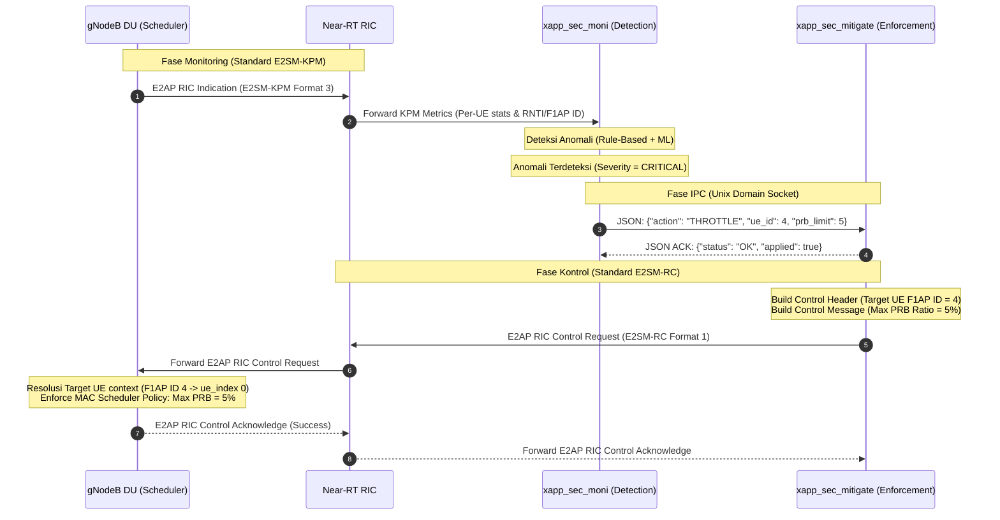

# Alur Mitigasi Native O-RAN (E2SM-RC PRB Throttling)

Dokumen ini menjelaskan arsitektur dan alur kerja mitigasi serangan data-plane (UL/DL Flood) menggunakan **E2SM-RC (Radio Control)** yang telah terintegrasi secara standar dengan spesifikasi **O-RAN Alliance WG3**.

---

## 1. Mengapa Desain Baru ini 100% O-RAN Compliant?

Dalam rancangan awal, mitigasi dilakukan dengan memanggil script SSH (`change_subscriber_slice.sh`) untuk merubah profil database subscriber di Core Network (Open5GS) dan me-restart layanan AMF/SMF. Cara ini **melanggar batas kontrol O-RAN (O-RAN Control Boundary)** karena:
1. **Out-of-band Control**: Intervensi jaringan dilakukan di luar antarmuka standar O-RAN.
2. **Core Network Disruption**: Memutus koneksi UE lain karena restart paksa service Core.

**Desain Baru (Native O-RAN E2SM-RC)**:
* Kontrol mitigasi dilakukan sepenuhnya melalui **antarmuka E2 (E2 interface)** yang menghubungkan Near-RT RIC dengan gNodeB (E2 Node).
* Mitigasi menggunakan service model standar **E2SM-RC (Style 2, Action ID 6 - Radio Resource Allocation Control)** untuk membatasi kuota PRB (Physical Resource Block) scheduler gNB secara dinamis per individual UE.

---

## 2. Diagram Alur Mitigasi (Sequence Diagram)

Berikut adalah urutan pesan dan interaksi antar entitas dalam arsitektur mitigasi:



---

## 3. Penjelasan Detail Langkah Demi Langkah (Step-by-Step)

### Langkah 1: Pengiriman Metrik Radio (E2SM-KPM)
gNodeB DU secara berkala mengirimkan laporan performa radio per-UE ke Near-RT RIC melalui pesan `RIC Indication` menggunakan model **E2SM-KPM Format 3**. Laporan ini berisi throughput, alokasi PRB, CQI, dan informasi identitas UE seperti **gNB-CU-UE-F1AP-ID** (DU F1AP ID).

### Langkah 2: Klasifikasi dan Deteksi Anomali
xApp utama (`xapp_sec_moni`) menerima metrik tersebut, melakukan ekstraksi fitur (*feature extraction*), dan memasukkannya ke dalam model deteksi (Hybrid Rule-Based + GRU/LSTM). Jika metrik traffic melampaui ambang batas (misalnya, UL flood memicu lonjakan PRB ekstrem), status UE ditandai sebagai `CRITICAL`.

### Langkah 3: Sinyal Mitigasi via IPC Socket
xApp monitor mengirimkan instruksi mitigasi berupa payload JSON ke xApp mitigator (`xapp_sec_mitigate`) melalui Unix Domain Socket:
```json
{
  "action": "THROTTLE",
  "prb_limit": 5,
  "ue_id": 4,
  "attack": "UL_FLOOD"
}
```

### Langkah 4: Konstruksi Pesan E2SM-RC Control
xApp mitigator membangun pesan kontrol radio standar:
* **Control Header (Format 1)**: Menetapkan target `ue_id` menggunakan DU F1AP ID yang diterima (misal `4`).
* **Control Message (Format 1)**: Menyusun parameter **RRM Policy Ratio Group** (ID 2 & 3) untuk membatasi kuota PRB maksimum (`Max PRB Policy Ratio` = 5%).

### Langkah 5: Pengiriman E2AP RIC Control Request
Near-RT RIC meneruskan pesan `RIC Control Request` tersebut ke gNodeB DU melalui koneksi SCTP antarmuka E2.

### Langkah 6: Eksekusi di Penjadwal Radio (gNB Scheduler)
Saat gNodeB DU menerima pesan kontrol tersebut:
1. **Resolusi Identitas UE (Fase Krusial)**: DU menggunakan modul `f1ap_ue_id_translator` untuk memetakan DU F1AP ID `4` ke `ue_index = 0` (RNTI `0x4602`) yang valid di database scheduler lokal.
2. **Penerapan Kebijakan**: DU MAC scheduler menerapkan limitasi PRB maksimum sebesar 5% khusus untuk UE tersebut. Penyerang langsung mengalami penurunan bandwidth drastis (hingga ~1 Mbps).
3. **Umpan Balik**: gNodeB mengirimkan pesan `RIC Control Acknowledge` kembali ke RIC sebagai konfirmasi bahwa mitigasi sukses diterapkan.

---

## 4. Analisis Tambahan untuk Dokumen TA: Masalah Osilasi Kontrol (Closed-Loop Oscillation)

Saat melakukan pengujian, Anda akan melihat throughput penyerang turun ke 1 Mbps selama **30 detik**, lalu kembali normal (>20 Mbps). Hal ini **bukan** karena RNTI penyerang berubah, melainkan akibat karakteristik **Closed-Loop Control**:
1. Ketika mitigasi berhasil menekan PRB penyerang hingga < 5%, metrik traffic penyerang menjadi sangat rendah.
2. AI xApp membaca kondisi rendah ini sebagai tanda jaringan telah "kembali normal/aman" (*attack subsided*).
3. Akibatnya, xApp mengirimkan sinyal `RESTORE` (PRB limit = 100%) ke gNodeB.
4. Begitu limit dikembalikan ke 100%, penyerang yang masih aktif langsung membanjiri jaringan kembali.

> [!NOTE]
> Fenomena osilasi ini merupakan bahan analisis akademis yang sangat bagus untuk bab pembahasan Tugas Akhir (TA) Anda, mendemonstrasikan pentingnya penentuan *Restore Policy* atau *Hysteresis Cooldown* yang tepat dalam sistem keamanan otomatis.
