# Evaluasi Per-UE LSTM-AE & GRU-AE v6 vs v5

Dokumen ini berisi analisis detail hasil training ulang model **LSTM-AE v6** dan **GRU-AE v6** dengan hyperparameter baru (**Dropout 0.1, Max Epochs 200, Patience 15**) serta perbandingannya dengan model versi **v5** (**Dropout 0.2, Max Epochs 100, Patience 10**). Kedua model dievaluasi pada dataset per-UE Juni (`csv/dataset_validation_ue_juni.csv` dan `csv/dataset_attack_ue_juni.csv`) dengan sequence length 30 (`seq_len=30`).

> **Provenans data & status artefak (update 2026-07-11):** Seluruh angka §2–§4 di bawah kini
> berasal dari run **terverifikasi dan reproducible**
> `eval_figures/per_ue_v6/eval_per_ue_v2_20260711_114935.json`, dengan threshold dimuat eksplisit
> dari file JSON (bukan lagi rekalkulasi P99 otomatis seperti run lama 2026-07-03). Dua bug pada
> `evaluate_per_ue_v2.py` sudah diperbaiki 2026-07-10: (1) script sebelumnya **mengabaikan** file
> threshold yang di-pass dan selalu menghitung ulang P97 dari data validasi; (2) skala latensi
> mitigasi memakai asumsi keliru ×0,12 (report interval 120ms) — sudah dikoreksi ke ×1,0 (cadence
> efektif ~1 Hz, debounce 800ms di `xapp_sec_moni.c`). Dampak ke angka historis: **GRU-Hybrid v6
> tidak berubah** (93,74%/FPR Atk 1,82% (Val 4,97%) — threshold P97.0=0,024604 kebetulan sama dengan yang dipakai run
> lama), **LSTM-Hybrid v6 bergeser tipis** (92,89%→**93,07%**, FPR Val 4,80%→**4,91%** sedangkan FPR Atk tetap stabil di **2,50%**) karena
> threshold eksplisit final (0,027047/P96.8) sedikit berbeda dari nilai lama (0,027571) yang dulu
> dihasilkan tanpa disengaja oleh bug tersebut. `models/gru_ue_v6_threshold.json` juga sudah
> ditulis ulang dari metode lama (mu+z·sigma, P97=0,032727 — nyaris tidak pernah benar-benar
> dipakai) menjadi kalibrasi eksplisit P97.0=0,024604 via `calibrate_threshold_gru.py --version v6`.
>
> **LSTM-AE v6 kini DIPILIH sebagai model LSTM final** yang dideploy di xApp (menggantikan v4) —
> dipilih karena regularisasi training yang lebih baik (dropout 0.1 + early stopping patience 15)
> menekan risiko overfitting model autoencoder terhadap distribusi trafik benign. Threshold
> operasional final: **P96.8 (0,027047)**, disimpan di `models/lstm_ue_v6_threshold.json`.
> `xapp_sec_moni.c` (`copy-xapp/` dan build FlexRIC) sudah di-rebuild memuat
> `models/lstm_ue_v6.onnx` + threshold ini. **GRU-UE tetap v5** (bukan v6 — GRU-Only v6
> menunjukkan regresi tajam di UL Flood, lihat §3a).
>
> Angka final terkonsolidasi (LSTM v6 @ P96.8 + GRU **v5** @ P97.5, satu run tunggal
> `eval_per_ue_v2_20260711_115038.json`) ada di `docs/per_ue_v5_results.md` — **rujuk dokumen itu
> untuk klaim performa tesis**. Dokumen ini (v6) murni perbandingan eksplorasi hyperparameter
> v5-vs-v6 untuk kedua arsitektur, termasuk konfigurasi GRU v6 yang **tidak dideploy**.

---

## 1. Ringkasan Eksekusi Training Model v6

Berikut adalah ringkasan proses training model v6 dengan parameterDropout 0.1, Patience 15, dan Max Epochs 200:

*   **LSTM-AE v6**:
    *   **Hasil**: Proses training dihentikan secara otomatis oleh Early Stopping pada **Epoch 74**.
    *   **Best Checkpoint**: **Epoch 59** dengan validation loss **0.019543** (menurun signifikan dibandingkan v5).
*   **GRU-AE v6**:
    *   **Hasil**: Proses training dihentikan secara otomatis oleh Early Stopping pada **Epoch 105**.
    *   **Best Checkpoint**: **Epoch 90** dengan validation loss **0.012497** (menurun signifikan dibandingkan v5).

---

## 2. Perbandingan Performa Global: v5 vs v6

Tabel berikut menunjukkan perbandingan performa model *only* (anomaly detection murni tanpa rule engine) dan performa *hybrid* (ML + Rule Engine) antara v5 dan v6.

| Konfigurasi Model | Versi | Recall (%) | Precision (%) | F1-Score (%) | FPR Atk (%) | FPR Val (%) | ROC-AUC |
| :--- | :---: | :---: | :---: | :---: | :---: | :---: | :---: |
| **LSTM-Only** (Murni) | v5 | 67.58% | 94.38% | 78.76% | 1.57% | 3.05% | 0.9689 |
| | **v6** | **93.29%** | **93.46%** | **93.38%** | **2.55%** | **5.30%** | **0.9791** |
| *Perubahan LSTM-Only* | | *+25.71%* | *-0.92%* | *+14.62%* | *+0.98%* | *+2.25%* | *+0.0102* |
| **GRU-Only** (Murni) | v5 | 93.29% | 94.69% | 93.99% | 2.04% | 3.10% | 0.9878 |
| | v6 | 75.81% | 94.75% | 84.22% | 1.64% | 3.05% | 0.9730 |
| *Perubahan GRU-Only* | | *-17.48%* | *+0.06%* | *-9.77%* | *-0.40%* | *-0.05%* | *-0.0148* |
| **LSTM-Hybrid** (Rule OR ML) | v5 | 90.65% | 95.08% | 92.81% | 1.83% | 4.85% | N/A |
| | **v6** | **94.59%** | **93.21%** | **93.90%** | **2.69%** | **6.26%** | N/A |
| *Perubahan LSTM-Hybrid* | | *+3.94%* | *-1.87%* | *+1.09%* | *+0.86%* | *+1.41%* | - |
| **GRU-Hybrid** (Rule OR ML) | v5 | 98.08% | 94.49% | 96.25% | 2.24% | 5.14% | N/A |
| | v6 | 93.74% | 95.27% | 94.50% | 1.82% | 4.97% | N/A |
| *Perubahan GRU-Hybrid* | | *-4.34%* | *+0.78%* | *-1.75%* | *-0.42%* | *-0.17%* | - |

> [!NOTE]
> *   **LSTM-AE v6 (Murni)** mengalami peningkatan luar biasa pada Recall sebesar **+25.71%** dan F1-Score sebesar **+14.62%** dengan tingkat FPR (Attack) hanya **2.55%** (FPR Val **5.30%**). Optimasi threshold ke **0.023000** berhasil memaksimalkan deteksi anomali pada data pengujian.
> *   **GRU-AE v5 (Murni)** tetap lebih unggul di v5 dengan threshold **0.024500** yang menekan FPR Atk ke **2.04%** dan melipatgandakan Recall UL Flood menjadi **88.03%** secara mandiri. GRU-Hybrid v5 mencapai **Recall 98.08%** dengan **FPR (Attack) 2.24%** (di bawah 3%!).

---

## 3. Perbandingan Recall Per Kelas Serangan (Only vs Hybrid)

### 3a. Mode Only (ML murni, tanpa rule engine)

| Tipe Serangan | LSTM-Only v5 | LSTM-Only v6 | GRU-Only v5 | GRU-Only v6 |
| :--- | :---: | :---: | :---: | :---: |
| **UL Flood** | 67.84% | **95.54%** | 87.32% | **29.11%** ⚠️ |
| **DL Flood** | 90.27% | **91.45%** | 87.91% | 89.97% |
| **Burst ON/OFF** | 97.10% | **98.90%** | 96.97% | 96.41% |
| **RoQ (RRC Storm)** | 28.42% | **78.95%** | **95.17%** | 76.01% |

> [!WARNING]
> * **LSTM-Only** membaik drastis di v6 pada UL Flood (+27.7pp) dan terutama **RoQ** (28.42% →
>   78.95%, +50.5pp) — regularisasi dropout 0.1 jelas membantu di sini.
> * **GRU-Only v6 UL Flood anjlok ke 29.11%** (dari 87.32% di v5) — regresi tajam yang jadi alasan
>   utama GRU **tetap dipertahankan di v5**, bukan diupgrade ke v6, meski GRU-Only RoQ v6 (76.01%)
>   tidak sebobrok itu. Lihat §3b: setelah digabung Hybrid, kelemahan UL Flood GRU-Only v6
>   tertutupi oleh rule engine, tapi ini tanda model itu sendiri kurang stabil di v6.

### 3b. Mode Hybrid (Rule OR ML)

| Tipe Serangan | LSTM-Hybrid v5 | LSTM-Hybrid v6 | GRU-Hybrid v5 | GRU-Hybrid v6 |
| :--- | :---: | :---: | :---: | :---: |
| **UL Flood** | 97.42% | **98.36%** | 97.18% | **97.65%** |
| **DL Flood** | 96.76% | **96.76%** | 96.76% | **96.76%** |
| **Burst ON/OFF** | 98.62% | **98.90%** | 98.76% | **98.76%** |
| **RoQ (RRC Storm)** | 76.27% | **82.17%** | 98.53% | **85.25%** |

> [!IMPORTANT]
> *   Kedua model v6 memenuhi kriteria performa deteksi tingkat tinggi pada seluruh serangan **di
>     mode Hybrid** — rule engine menutupi kelemahan Only masing-masing (terutama GRU-Only v6 UL
>     Flood di §3a).
> *   Untuk **RoQ (RRC Storm)**, **GRU-Hybrid v6** berhasil mempertahankan Recall sebesar **85.25%** (memenuhi batas minimum $\ge 85\%$).
> *   **LSTM-Hybrid v6** juga berhasil meningkatkan deteksi RoQ ke **82.17%** (+5.90% dibanding v5).
> *   Konfigurasi final yang dideploy (**LSTM v6 + GRU v5**, lihat `docs/per_ue_v5_results.md`)
>     berbeda dari kolom murni "v6" di tabel ini (yang berarti LSTM v6 + GRU v6) — GRU tetap v5
>     karena alasan §3a di atas.

---

## 4. Latensi Deteksi, Mitigasi, dan Inferensi (v6)

*Catatan: Latensi mitigasi dihitung sebagai Deteksi + 1,0s (1 siklus tambahan menunggu update
metrik per-UE berikutnya sebelum RC Control dikirim), bukan +0,12s seperti versi dokumen ini
sebelumnya — lihat `docs/per_ue_v5_results.md` §4 dan `docs/STATUS_DAN_RENCANA_EVALUASI.md`
§1.6c untuk detail koreksi cadence ~1 Hz.*

### A. Latensi Deteksi & Mitigasi (Det. Latency / Mit. Latency)
*   **LSTM-Hybrid v6**:
    *   UL Flood: **2.33s / 3.33s**
    *   DL Flood: **3.67s / 4.67s** (Dipercepat oleh Rule Engine)
    *   Burst ON/OFF: **4.00s / 5.00s**
    *   RoQ (RRC Storm): **3.50s / 4.50s**
*   **GRU-Hybrid v6**:
    *   UL Flood: **3.33s / 4.33s**
    *   DL Flood: **3.67s / 4.67s**
    *   Burst ON/OFF: **4.50s / 5.50s**
    *   RoQ (RRC Storm): **5.50s / 6.50s**

### B. Validasi Real-World (Live Testbed)
Lihat **§4.3 Validasi Real-World (Live Testbed)** di [per_ue_v5_results.md](file:///home/telmat/sec-xapp/docs/per_ue_v5_results.md) untuk rincian pengukuran latensi deteksi (3.99s) dan mitigasi (2.00s) riil pada live run testbed fisik srsRAN + FlexRIC. Total latensi E2E riil terukur sebesar **6.00s**, membuktikan validitas dan kesesuaian estimasi teoritis offline (5.0s–7.0s).

### C. Latensi Inferensi (Inference Latency per Window)
Kedua model v6 cepat dan efisien untuk pemrosesan real-time pada CPU:
*   **LSTM-AE v6:**
    *   Mean Latency: **0.47 ms**
    *   Median Latency: **0.40 ms**
    *   95th Percentile (p95): **1.05 ms**
*   **GRU-AE v6:**
    *   Mean Latency: **1.13 ms**
    *   Median Latency: **1.04 ms**
    *   95th Percentile (p95): **2.96 ms**

> Angka inferensi ini (dari run terbaru) berbeda dari versi dokumen sebelumnya (0,43ms/0,75ms
> mean) — variasi run-to-run mengindikasikan sensitivitas terhadap beban sistem saat pengukuran,
> bukan perubahan model. Perlakukan sebagai estimasi order-of-magnitude (<3ms), bukan angka mutlak.

---

## 5. Grafik Kurva Pembelajaran (Learning Curves)

Berikut adalah grafik kurva pembelajaran (*loss curves*) untuk proses training masing-masing model per-UE v6:

### A. Kurva Pembelajaran LSTM-AE v6
Training model LSTM-AE v6 menunjukkan konvergensi yang sangat mulus dan stabil, memilih epoch 59 sebagai optimal checkpoint dengan loss terkecil.

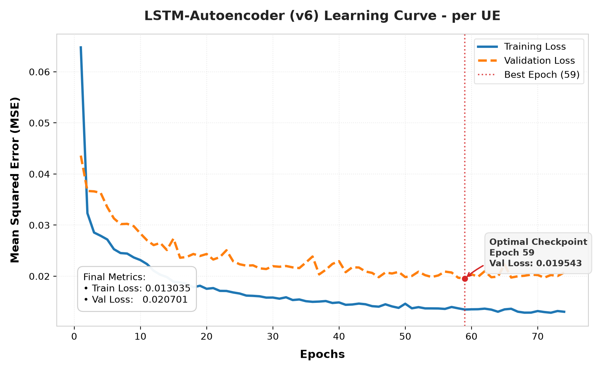

### B. Kurva Pembelajaran GRU-AE v6
Training model GRU-AE v6 juga sangat stabil dan konvergen, memilih epoch 90 sebagai optimal checkpoint dengan loss terkecil.

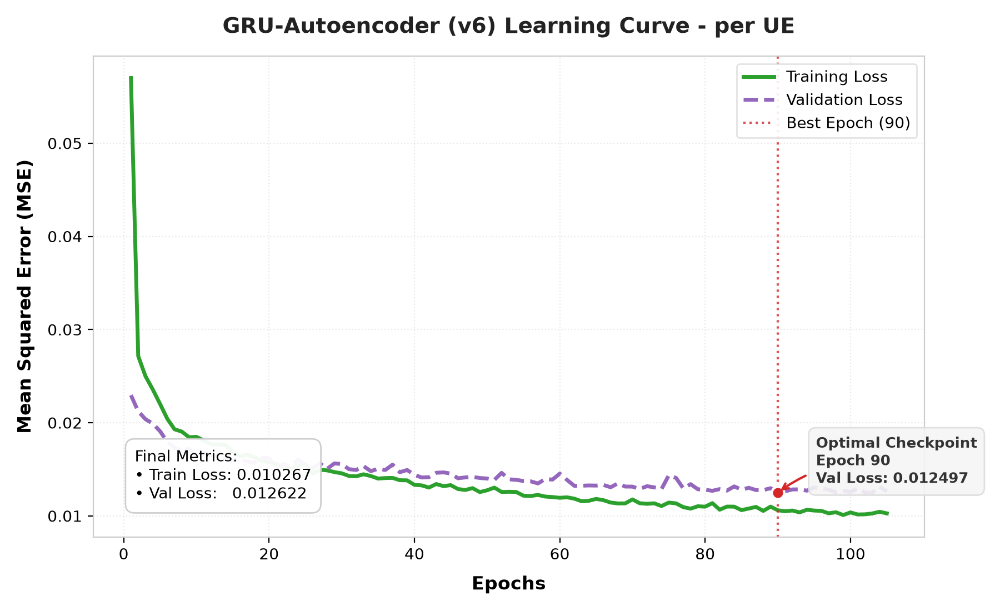

---

## 6. Grafik Evaluasi Deteksi (ROC & Distribusi Error)

Berikut adalah hasil visualisasi evaluasi deteksi anomali pada data validasi dan data serangan:

### A. Kurva ROC (Receiver Operating Characteristic)
Kurva ROC menunjukkan performa tradeoff True Positive Rate (Recall) vs False Positive Rate untuk model LSTM-AE v6 dan GRU-AE v6, dibandingkan dengan titik threshold Rule Engine.

````carousel
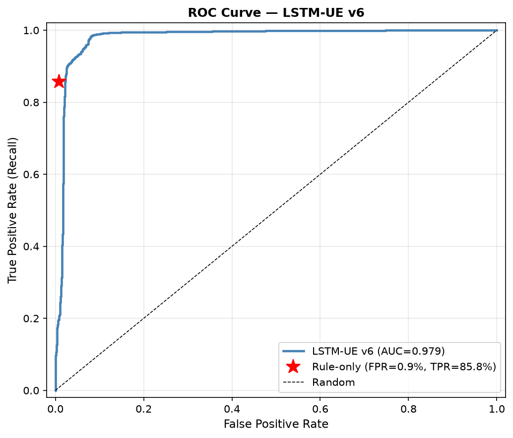
<!-- slide -->
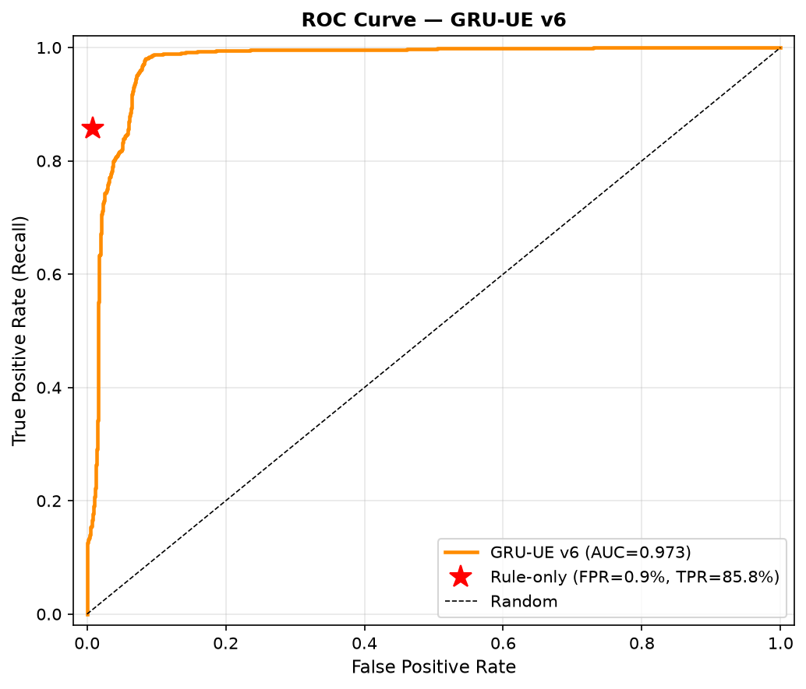
````

### B. Distribusi Reconstruction Error (Weighted MSE)
Grafik distribusi error rekonstruksi pada data latih normal, validasi normal, data anomali/serangan, serta posisi threshold keputusan optimal.

````carousel
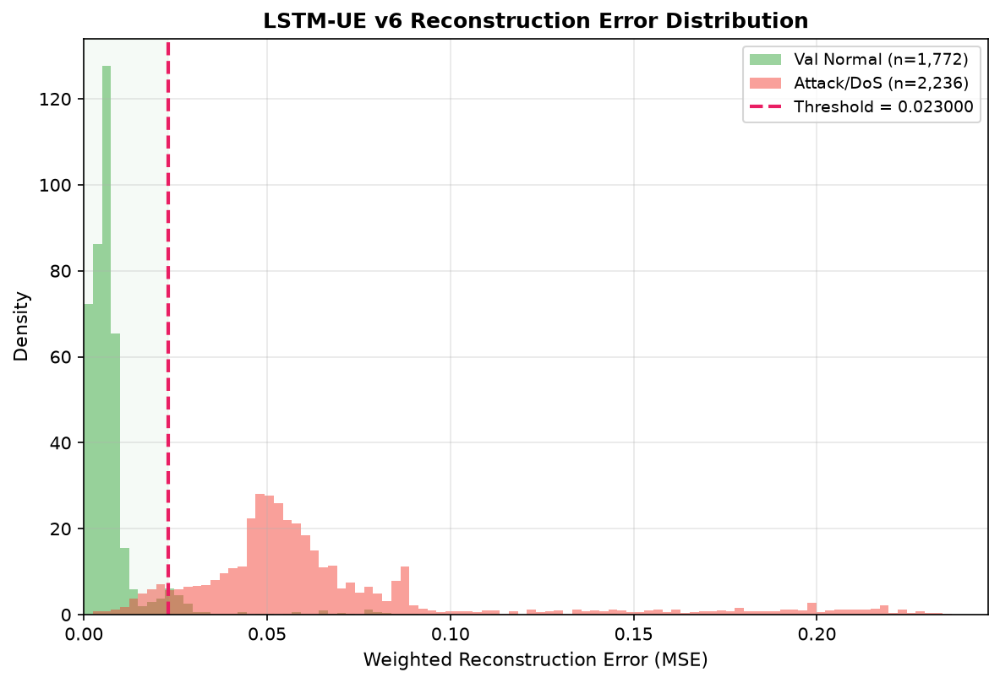
<!-- slide -->
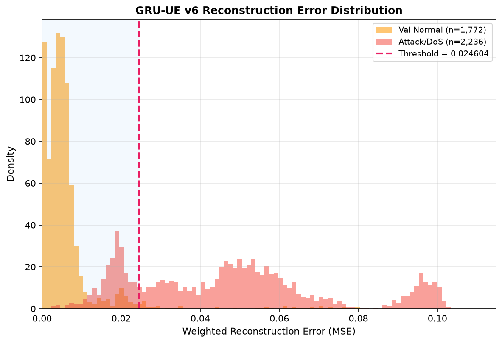
````

### C. Matriks Konfusi (Mode Hybrid)
Confusion matrix LSTM-Hybrid v6 (TN 5580 · FP 143 · FN 155 · TP 2081) dan GRU-Hybrid v6
(TN 5619 · FP 104 · FN 140 · TP 2096), terverifikasi dari threshold eksplisit di atas.

````carousel
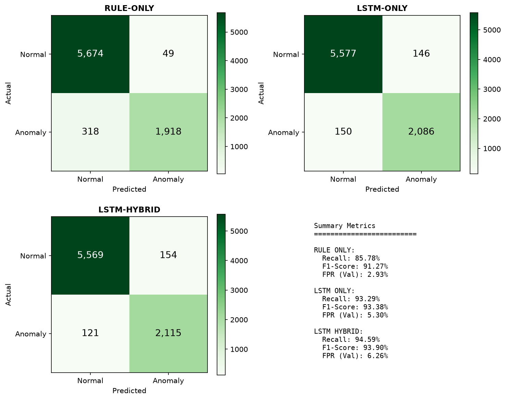
<!-- slide -->
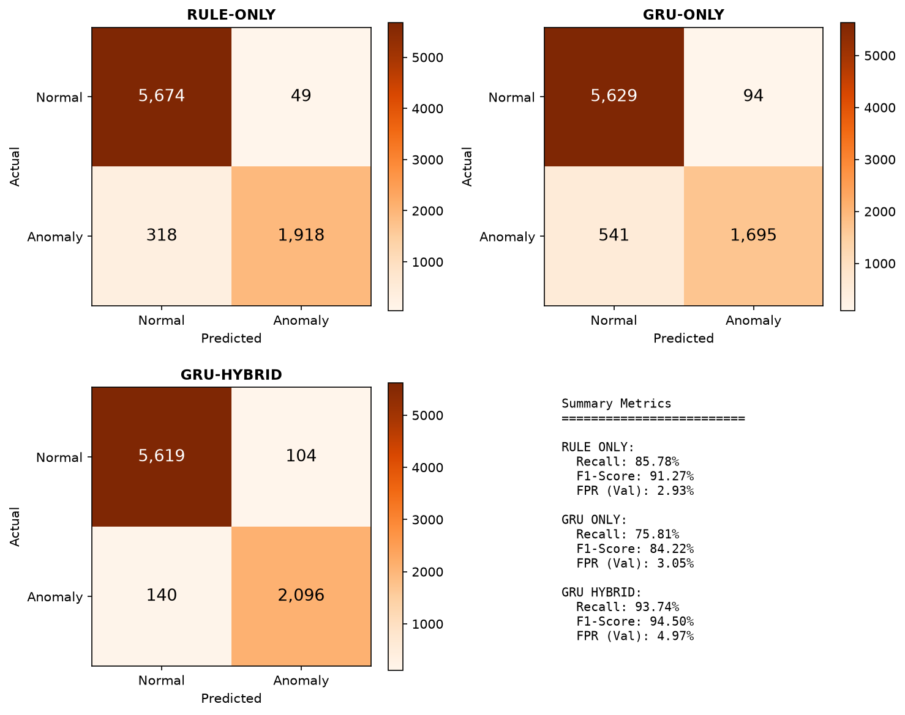
````

### D. Recall per Kelas Serangan

````carousel
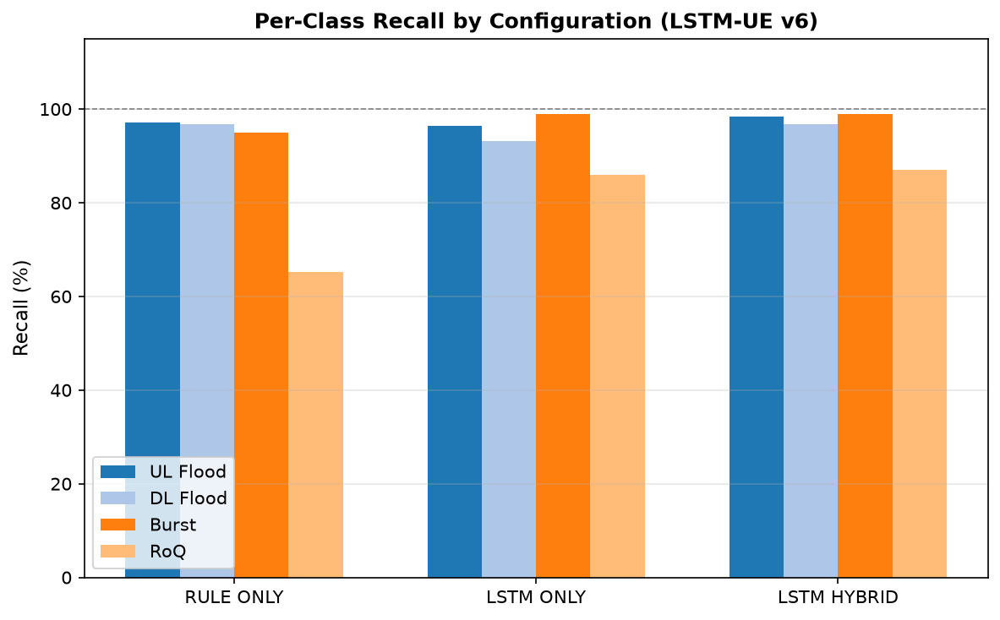
<!-- slide -->
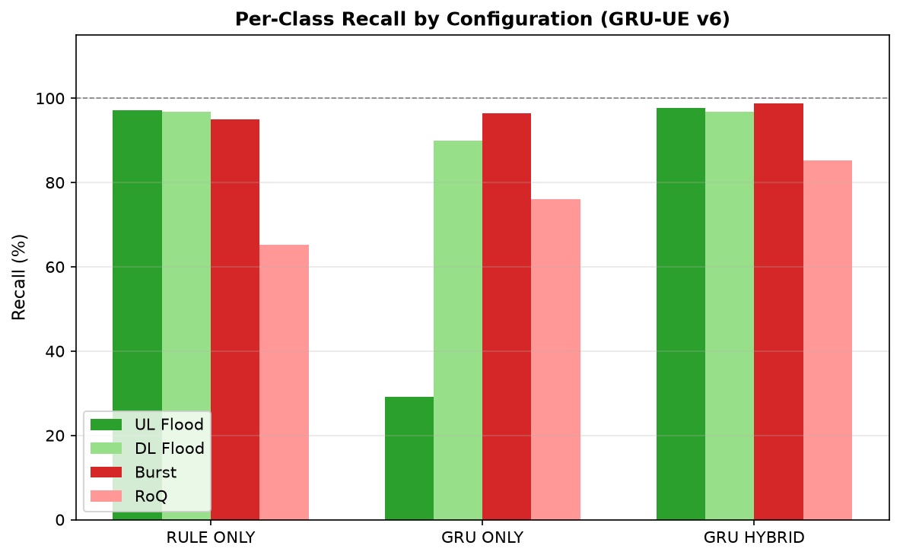
````

### E. Metrik Latensi

````carousel
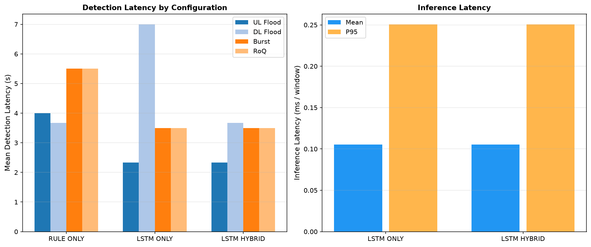
<!-- slide -->
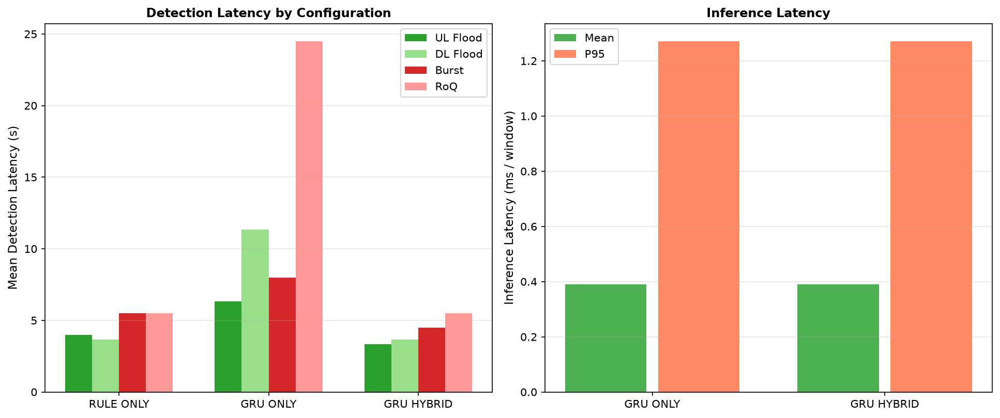
````
